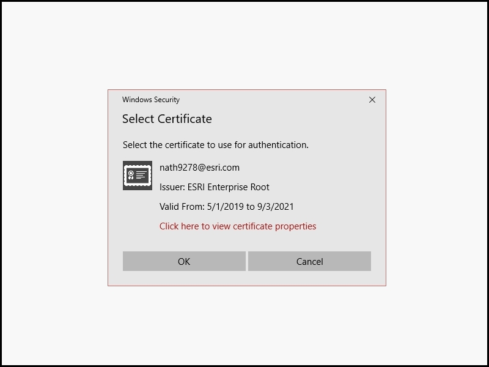

# Certificate authentication with PKI

Access secured portals using a certificate.

## Use case

Many enterprises use PKI (Public Key Infrastructure) to secure resources without requiring users to remember passwords. One common form of certificate authentication involves using a smart card, which stores certificates and provides them on demand. for example, the United States Department of Defense issues [Common Access Cards](https://www.cac.mil/common-access-card/), which enables access to DoD computer systems.

## How to use the sample

> **NOTE**: You must provide your own ArcGIS Server with PKI authentication configured.

Provide a URL to a PKI-enabled server, then use the certificate selection UI to select an appropriate certificate for that server.

## How it works - Windows WPF

1. Create the X.509 certificate store, referring to the user's certificates.
2. Open the certificate store in read-only mode.
3. Find all certificates that are currently valid.
4. Display the Windows certificate selection UI to choose from the returned certificates.
5. Create the ArcGIS Runtime credential with the chosen certificate.
6. Create the Portal, explicitly passing in the credential that was created.

## Relevant API

* CertificateCredential

## Additional information

ArcGIS Enterprise requires special configuration to enable support for PKI. PKI authentication can be set up to work with accounts managed by [Windows Active Directory](https://enterprise.arcgis.com/en/portal/latest/administer/windows/using-windows-active-directory-and-pki-to-secure-access-to-your-portal.htm) or [LDAP](https://enterprise.arcgis.com/en/portal/latest/administer/windows/use-ldap-and-pki-to-secure-access-to-your-portal.htm).

## Tags

smartcard, PKI, certificate, store, X509, authentication, login, passwordless