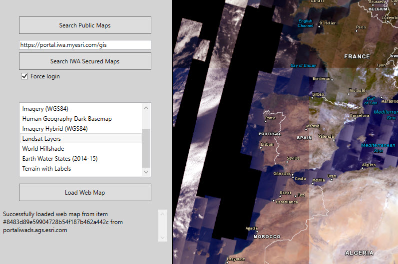

# Integrated Windows Authorization

This sample demonstrates how to use a Windows login to authenticate with a portal that is secured with IWA.

## Instructions

1. Enter the URL to your IWA-secured portal.
2. Click the button to search for web maps on the secure portal.
3. If 'Force login' is unchecked, your current credentials will be used to view content on the portal.
4. If your current account lacks permissions or 'Force login' is checked, you will be prompted for a user name, password, and domain.
5. If you authenticate successfully, search results will display.