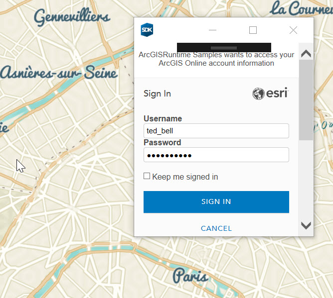

# Authenticate with OAuth

This sample demonstrates how to authenticate with ArcGIS Online (or your own portal) using OAuth2 to access secured resources (such as private web maps or layers). Accessing secured items requires a login on the portal that hosts them (an ArcGIS Online account, for example).

## Use case

Your app may need to access items that are only shared with authorized users. For example, your organization may host private data layers or feature services that are only accessible by verified users. You may also need to take advantage of premium ArcGIS Online services, such as geocoding or routing, that require a named user login.

## How it works

1. When the app loads, a web map containing premium content (world traffic service) is loaded in the map view.
2. In response to the attempt to access secured content, the `AuthenticationManager` shows an OAuth authentication dialog from ArcGIS Online.
3. If the user authenticates successfully, the world traffic service appears in the map. Otherwise, only the basemap appears.

## Relevant API

* ArcGISPortal
* AuthenticationManager
* Credential

## Tags

Authentication, OAuth, Security
