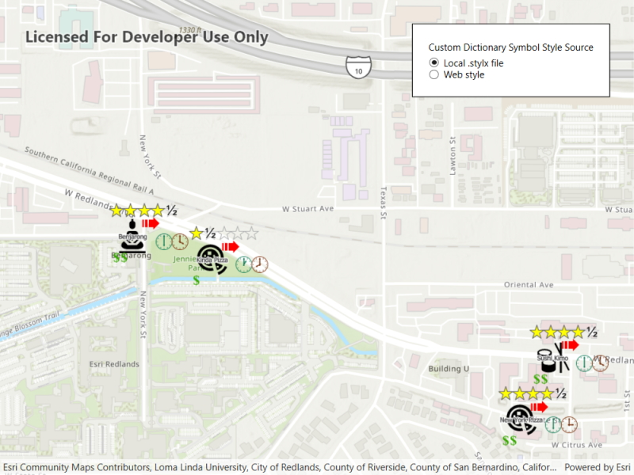

# Custom dictionary style

Use a custom dictionary style (.stylx) to symbolize features using a variety of attribute values.

## Use case

When symbolizing geoelements in your map, you may need to convey several pieces of information with a single symbol. You could try to symbolize such data using a unique value renderer, but as the number of fields and values increases, that approach becomes impractical. With a dictionary renderer you can build each symbol on-the-fly, driven by one or more attribute values, and handle a nearly infinite number of unique combinations.

## How to use the sample

Pan and zoom the map to see the symbology from the custom dictionary style.

## How it works

1. Create a new `DictionarySymbolStyle` by passing in the path to the custom style file (.stylx).
2. Create a new `DictionaryRenderer`, providing the dictionary symbol style.
3. Apply the dictionary renderer to a feature layer using `Renderer` property of the layer.

## Relevant API

* DictionaryRenderer
* DictionarySymbolStyle
* DictionarySymbolStyleConfiguration

## Offline data

This sample downloads the following items from ArcGIS Online automatically:

* [Restaurant dictionary style](https://www.arcgis.com/home/item.html?id=751138a2e0844e06853522d54103222a)

## About the data

The data used in this sample is from a feature layer showing a subset of [restaurants in Redlands, CA](https://services2.arcgis.com/ZQgQTuoyBrtmoGdP/arcgis/rest/services/Redlands_Restaurants/FeatureServer) hosted as a feature service with attributes for rating, style, health score, and open hours. The feature layer is symbolized using a dictionary renderer that displays a single symbol for all of these variables. The renderer uses symbols from a custom [restaurant dictionary style](https://www.arcgis.com/home/item.html?id=751138a2e0844e06853522d54103222a), available as an item from ArcGIS Online, to show unique symbols based on several feature attributes. The symbols it contains were created using ArcGIS Pro. The logic used to apply the symbols comes from an Arcade script embedded in the stylx file (which is a SQLite database), along with a JSON string that defines expected attribute names and configuration properties.

## Additional information

For information about creating your own custom dictionary style, see the open source [dictionary renderer toolkit](https://github.com/Esri/dictionary-renderer-toolkit) on *GitHub*.

## Tags

dictionary, military, renderer, style, stylx, unique value, visualization