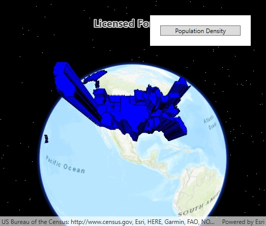

# Feature layer extrusion

Extrude features based on their attributes.

## Use case

Extrusion is the process of stretching a flat, 2D shape vertically to create a 3D object in a scene. For example, you can extrude building polygons by a height value to create three-dimensional building shapes.

## How to use the sample

Press the button to switch between using population density and total population for extrusion. Higher extrusion directly corresponds to higher attribute values.

## How it works

1. Create a `ServiceFeatureTable` from a URL.
2. Create a feature layer from the service feature table.
    * Make sure to set the rendering mode to dynamic.
3. Apply a `SimpleRenderer` to the feature layer.
4. Set `ExtrusionMode` of render, `renderer.SceneProperties.ExtrusionMode = SceneProperties.ExtrusionMode.BaseHeight`.
5. Set extrusion expression of renderer, `renderer.SceneProperties.ExtrusionExpression = "[POP2007]/ 10"`.

## Relevant API

* ExtrusionExpression
* ExtrusionMode
* FeatureLayer
* FeatureLayer
* SceneProperties
* ServiceFeatureTable
* SimpleRenderer

## Tags

3D, extrude, extrusion, extrusion expression, height, renderer, scene