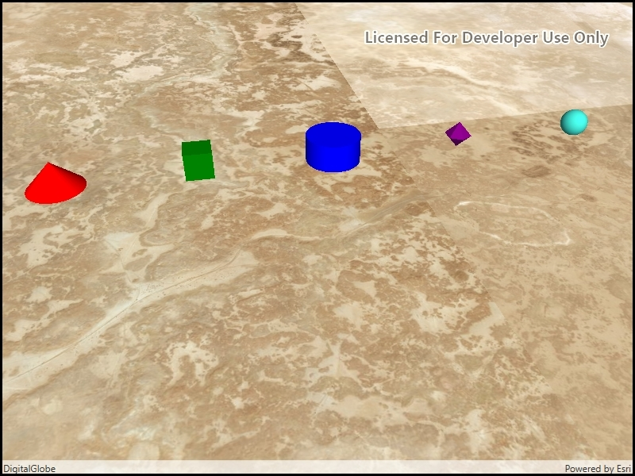

# Scene symbols

Show various kinds of 3D symbols in a scene.

## How to use the sample

Various symbols will be shown in the scene when it loads.

## How it works

1. A `GraphicsOverlay` is created.
2. Various simple scene symbols are created.
3. Graphics are created with the scene symbols.
4. The graphics are added to the graphics overlay.
5. The graphics overlay is added to the scene view.

## Relevant API

* SimpleMarkerSceneSymbol
* SimpleMarkerSceneSymbol.Style
* SceneSymbol.AnchorPosition

## About the data

This sample shows arbitrary symbols in an empty scene with imagery basemap.

## Tags

Scenes, symbols, graphics, graphics overlay, 3D, cone, cylinder, tube, sphere, diamond, tetrahedron