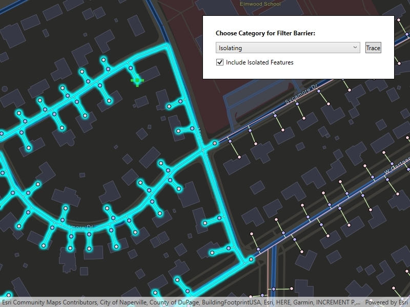

# Perform valve isolation trace

Run a filtered trace to locate operable features that will isolate an area from the flow of network resources.

## Use case

Determine the set of operable features required to stop a network's resource, effectively isolating an area of the network. For example, you can choose to return only accessible and operable valves: ones that are not paved over or rusted shut.

## How to use the sample

Tap on one or more features to use as filter barriers or create and set the configuration's filter barriers by selecting a category. Check or uncheck 'Include Isolated Features'. Click 'Trace' to run a subnetwork-based isolation trace. Click 'Reset' to clear filter barriers.

## How it works

1. Create a `MapView` and subscribe to its `GeoViewTapped` event.
2. Create and load a `ServiceGeodatabase` with a feature service URL and get tables by their layer IDs.
3. Create a `Map` that contains `FeatureLayer`(s) created from the `ServiceGeodatabase`'s tables.
4. Create and load a `UtilityNetwork` with the same feature service URL and this `Map`.
5. Create `UtilityTraceParameters` with `UtilityTraceType.Isolation` and a starting location from a given asset type and global ID.
6. Get a default `UtilityTraceConfiguration` from a given tier in a domain network to set `UtilityTraceParameters.TraceConfiguration`.
7. Add a `GraphicsOverlay` with a `Graphic` that represents this starting location; and another `GraphicsOverlay` for filter barriers.
8. Populate the choice list for the 'Filter Barrier: Category exists' from `UtilityNetworkDefinition.Categories`.
9. When the MapView is tapped, identify which features are at the tap location and add a `Graphic` that represents a filter barrier.
10. Create a `UtilityElement` for the identified feature and add this `UtilityElement` to a collection of filter barriers.
      * If the element is a junction with more than one terminal, display a terminal picker. Then set the junction's `Terminal` property with the selected terminal.
      * If an edge, set its `FractionAlongLine` property using `GeometryEngine.FractionAlong`.  
11. If 'Trace' is clicked without filter barriers:
      * Create a new `UtilityCategoryComparison` with the selected category and `UtilityCategoryComparisonOperator.Exists`.
      * Create a new `UtilityTraceFilter` with this condition as `Barriers` to set `Filter` and update `IncludeIsolatedFeatures` properties of the default configuration from step 5.
      * Run a `UtilityNetwork.TraceAsync`.
  
    If 'Trace' is clicked with filter barriers:
      * Update `IncludeIsolatedFeatures` property of the default configuration from step 5.
      * Run a `UtilityNetwork.TraceAsync`.
12. For every `FeatureLayer` in the map, select the features returned with `GetFeaturesForElementsAsync` from the elements matching their `NetworkSource.FeatureTable` with the layer's `FeatureTable`.

## Relevant API

* FractionAlong
* ServiceGeodatabase
* UtilityCategory
* UtilityCategoryComparison
* UtilityCategoryComparisonOperator
* UtilityDomainNetwork
* UtilityElement
* UtilityElementTraceResult
* UtilityNetwork
* UtilityNetworkDefinition
* UtilityTerminal
* UtilityTier
* UtilityTraceFilter
* UtilityTraceParameters
* UtilityTraceResult
* UtilityTraceType

## About the data

The [Naperville gas](https://sampleserver7.arcgisonline.com/server/rest/services/UtilityNetwork/NapervilleGas/FeatureServer) network feature service contains a utility network used to run the isolation trace shown in this sample. Authentication is required and handled within the sample code.

## Additional information

Using utility network on ArcGIS Enterprise 10.8 requires an ArcGIS Enterprise member account licensed with the [Utility Network user type extension](https://enterprise.arcgis.com/en/portal/latest/administer/windows/license-user-type-extensions.htm#ESRI_SECTION1_41D78AD9691B42E0A8C227C113C0C0BF). Please refer to the [utility network services documentation](https://enterprise.arcgis.com/en/server/latest/publish-services/windows/utility-network-services.htm).

## Tags

category comparison, condition barriers, filter barriers, isolated features, network analysis, subnetwork trace, trace configuration, trace filter, utility network
