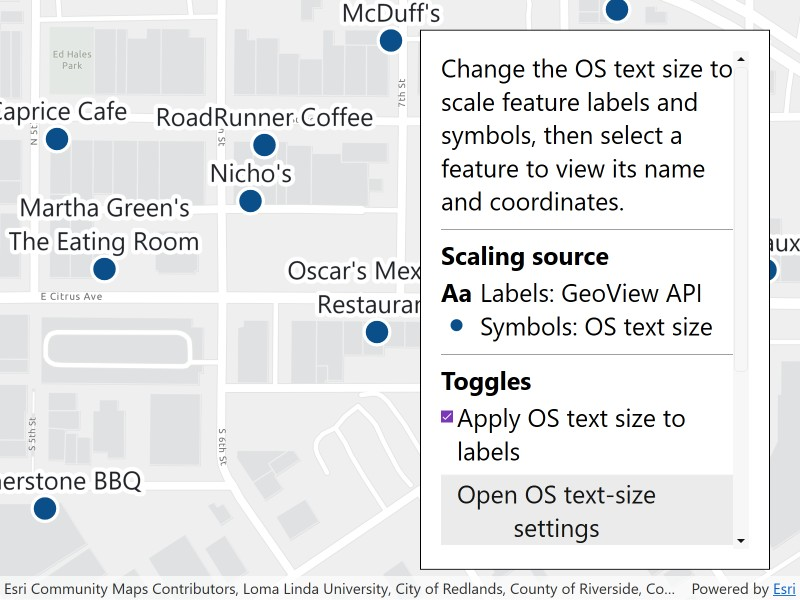

# Update labels and symbols to scale for visual accessibility

Scale feature labels and symbols according to the system text-size setting.

## Use case

Use this pattern to improve map readability for users who increase text size in their operating system’s accessibility settings. Enable `GeoView.UseSystemTextScale` to scale feature labels automatically. To scale feature symbols, subscribe to system text-size changes and apply the reported scaling factor to the symbol sizes.

## How to use the sample

Change the text size in Windows accessibility settings to see the restaurant labels and symbols resize. Use **Open OS text-size settings** to open the relevant settings page.

Clear **Apply OS text size to labels** to stop labels from following the system text size, then select it again to restore system text scaling. Restaurant symbols continue to follow the system text size independently of this setting. The legend and current values show how labels and symbols are scaled.

Select a restaurant to show its name and WGS 84 coordinates in a callout. Select elsewhere to clear the callout.

## How it works

1. Create a `Map` and add a `FeatureLayer`.
2. Open `Esri2DPointSymbolsStyle` with `SymbolStyle.OpenAsync` and get the `restaurant` symbol with `GetSymbolAsync`. Set the resulting `MultilayerPointSymbol.Size` to 24 DIPs, create a fixed-size legend image with `CreateSwatchAsync` and `ToImageSourceAsync`, and apply the symbol to the feature layer with a `SimpleRenderer`.
3. Load the feature layer, then add a `LabelDefinition` with a `TextSymbol`.
4. To scale labels, enable `GeoView.UseSystemTextScale`.
5. To scale symbols, read `UISettings.TextScaleFactor` and observe `UISettings.TextScaleFactorChanged`. Multiply the base size by the text-scale factor and set `MultilayerPointSymbol.Size` to scale all symbol layers proportionately.
6. Use the checkbox to toggle system text scaling for labels without changing symbol scaling.
7. Identify a restaurant with `IdentifyLayerAsync` and show its name and WGS 84 coordinates in a callout.

## Relevant API

* GeoView.UseSystemTextScale

## About the data

This sample uses a [Redlands restaurants](https://www.arcgis.com/home/item.html?id=46119989eccd46a58b8f3d7aedadeb90) feature layer covering food establishments in Redlands, California. Each feature represents a single restaurant.

The restaurant symbol comes from [Esri's 2D point symbol web style](https://www.arcgis.com/home/item.html?id=220936cc6ed342c9937abd8f180e7d1e). Its 24-DIP base size makes the icon's detail easier to distinguish. The legend stays at this base size while map symbols follow the system text size.

## Additional information

On WPF, use `GeoView.UseSystemTextScale` to control system text scaling for feature labels. Use `UISettings.TextScaleFactor` and `UISettings.TextScaleFactorChanged` to scale symbols and respond to Windows text-size changes.

## Tags

accessibility, label, readability, scale, symbol, text, visual impairment