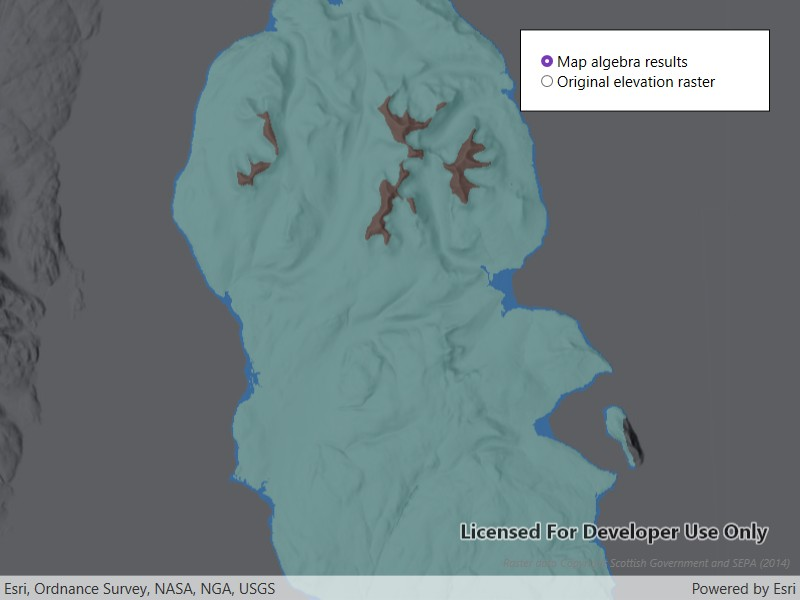

# Apply map algebra

Apply map algebra to an elevation raster to floor, mask, and categorize the elevation values into discrete integer-based categories.

## Use case

Categorizing raster data, such as elevation values, into distinct categories is a common spatial analysis workflow. This often involves applying threshold‑based logic or algebraic expressions to transform continuous numeric fields into discrete, integer‑based categories suitable for downstream analytical or computational operations. These operations can be specified and applied using map algebra.

## How to use the sample

When the sample opens, it displays the source elevation raster. Select the **Categorize** button to generate a raster with three distinct ice age related geomorphological categories (raised shore line areas in blue, ice free high ground in brown and areas covered by ice in teal). After processing completes, use the radio buttons to switch between the map algebra results raster and the original elevation raster.

## How it works

1. Create a `ContinuousField` from a raster file using `ContinuousField.CreateAsync`.
2. Create a `ContinuousFieldFunction` from the continuous field and mask values below sea level using `IsGreaterThanOrEqualTo`.
3. Round elevation values down to the lowest 10-meter interval with map algebra operators
    `((continuousFieldFunction / 10).Floor() * 10)`, and then convert the result to a `DiscreteFieldFunction` with
    `ToDiscreteFieldFunction`.
4. Create `BooleanFieldFunction`s for each category by defining a range with map algebra operators such as
    `IsGreaterThanOrEqualTo`, `LogicalAnd`, and `IsLessThan`.
5. Create a new `DiscreteField` by chaining `ReplaceIf` operations into discrete category values and evaluating the
    result with `EvaluateAsync`.
6. Export the discrete field to files with `ExportToFilesAsync` and create a `Raster` with the result. Use it to create
    a `RasterLayer`.
7. Apply a `ColormapRenderer` to the raster and display it in the map view.

## Relevant API

* BooleanFieldFunction
* ColormapRenderer
* ColorRamp
* ContinuousField
* ContinuousFieldFunction
* DiscreteField
* DiscreteFieldFunction
* MinMaxStretchParameters
* Raster
* RasterLayer
* StretchRenderer

## About the data

The sample uses a [10m resolution digital terrain elevation raster of the Isle of Arran, Scotland](https://www.arcgis.com/home/item.html?id=aa97788593e34a32bcaae33947fdc271)
(Data Copyright Scottish Government and SEPA (2014)).

## Tags

elevation, map algebra, raster, spatial analysis, terrain
