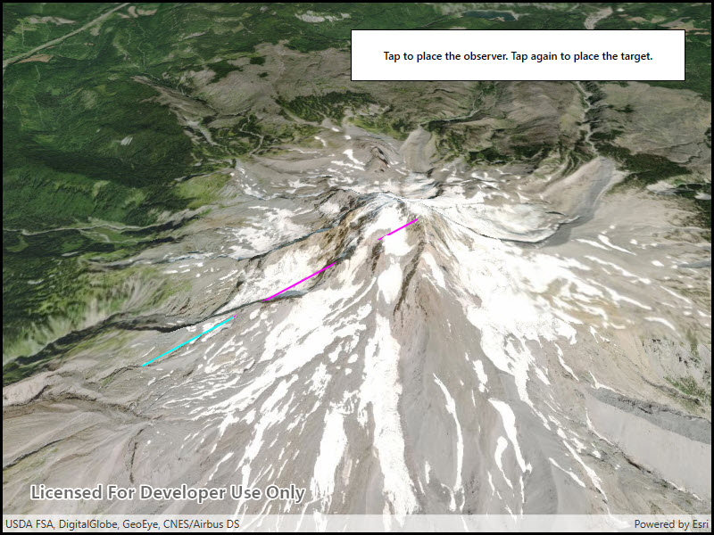

# Show exploratory line of sight between points

Perform an exploratory line of sight analysis between two points in real time.

## Use case

An exploratory line of sight analysis can be used to assess whether a view is obstructed between an observer and a target. Obstructing features could either be natural, like topography, or man-made, like buildings. Consider an events planning company wanting to commemorate a national event by lighting sequential beacons across hill summits or roof tops. To guarantee a successful event, ensuring an unobstructed line of sight between neighboring beacons would allow each beacon to be activated as intended.

Note: This analysis is a form of "exploratory analysis", which means the results are calculated on the current scale of the data, and the results are generated very quickly but not persisted. If persisted analysis performed at the full resolution of the data is required, consider using a `LineOfSightFunction` to perform a line of sight calculation instead.

## How to use the sample

The sample loads with a preset observer and target location, linked by a colored line. A red segment on the line means the view between observer and target is obstructed, whereas green means the view is unobstructed.

Click to place the starting (observer) point for the line. Click again to place the end (target) point.

## How it works

1. Create an `AnalysisOverlay` and add it to the scene view.
2. Create an `ExploratoryLocationLineOfSight` with initial observer and target locations and add it to the analysis overlay.
3. Listen for clicks on the scene.
4. Update the target and observer positions by updating `ExploratoryLocationLineOfSight.ObserverLocation` and `ExploratoryLocationLineOfSight.TargetLocation`.

## Relevant API

* AnalysisOverlay
* ExploratoryLocationLineOfSight
* SceneView

## Tags

3D, exploratory line of sight, visibility, visibility analysis
