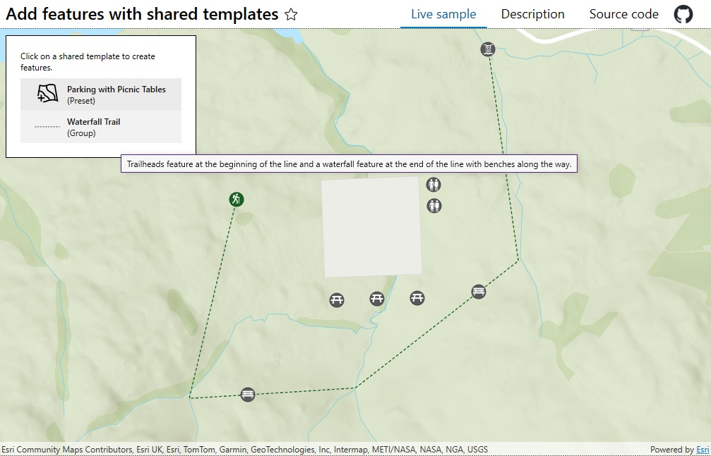

# Add features with shared templates

Create features from preset and group shared templates.

## Use case

Preset and group shared templates support guided, repeatable, high-quality editing. Preset templates place predefined feature arrangements, while group templates create feature sets relative to a user-defined base geometry. By automatically applying attributes, symbology, geometry settings, and feature relationships/associations, they help field staff create consistent, fully configured assets with only a few choices.

## How to use the sample

Hover over a shared template to view its description. Select a template and click on the map to place the geometry. Choose "Complete" to create the feature, "Save" to apply local edits, or "Undo" to discard them.

## How it works

1. Create a map using the URL to a web map.
2. Determine the `ISharedTemplateSource` by inspecting map layers, identifying `FeatureLayer` instances backed by a `ServiceFeatureTable`, and retrieving their `ServiceGeodatabase`.
3. Call `ISharedTemplateSource.QuerySharedTemplatesAsync()` to populate a template picker. Store each template's `layerId`, display its name and type, and use native contextual help to show its description.
4. Call `SharedTemplate.CreateSwatchAsync(layerId)` to generate a swatch image for each template, falling back to a default image when a swatch is unavailable.
5. Call `SharedTemplate.GetDefaultConstructionTool(layerId)` to get the template’s default construction method. Use its `GeometryConstructionTool.ToolType` to choose whether the `GeometryEditor` draws a point or polyline.
6. After the user selects "Complete", call `GeometryEditor.Stop()` and use the returned geometry to create features with `ISharedTemplateSource.CreateFeaturesAsync(sharedTemplate, geometry)`. Then call `ISharedTemplateSource.AddFeaturesAsync()` to add the resulting feature set to the geodatabase.
7. Select "Save" to apply local edits with `ServiceGeodatabase.ApplyEditsAsync()`, or select "Undo" to discard them with `ServiceGeodatabase.UndoLocalEditsAsync()`.

## Relevant API

* GeometryConstructionTool
* GeometryEditor
* ISharedTemplateSource
* ServiceGeodatabase
* SharedTemplate
* SharedTemplateFeatureCreationSet
* SharedTemplateQueryParameters

## About the data

* The sample uses the [Parks and Grounds Assets](https://www.maps.arcgis.com/home/item.html?id=b635be46dfb545b888077389ac7f0962) web map.

## Tags

edit, feature, group, preset, shared template, shared template source, template
