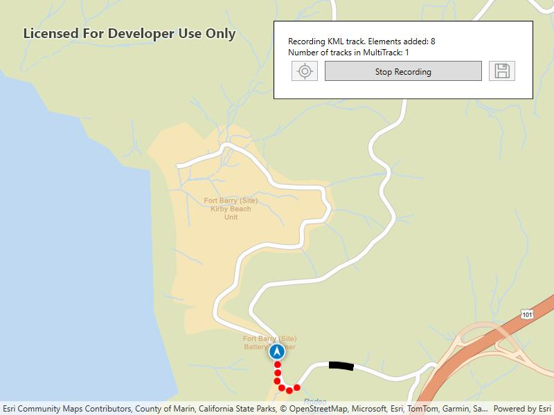

# Create KML multi-track

Create, save and preview a KML multi-track, captured from a location data source.

## Use case

When capturing location data for outdoor activities such as hiking or skiing, it can be useful to record and share your path. This sample demonstrates how you can collect individual KML tracks during a navigation session, then combine and export them as a KML multi-track.

## How to use the sample

Tap **Start Navigation** to begin moving along a simulated trail. Tap **Record Track** to start recording your current path. Tap **Stop Recording** to end recording and capture a KML track. Repeat these steps to capture multiple KML tracks in a single session. Tap the **Save** button to save your recorded tracks as a `.kmz` file to local storage. Then load the created `.kmz` file containing your KML multi-track to view all created tracks on the map.

## How it works

1. Create an `ArcGISMap` with a basemap and a `GraphicsOverlay` to display the path geometry for your navigation route.
2. Create a `SimulatedLocationDataSource` to drive the `LocationDisplay`.
3. As you receive `Location` updates, add each point to a list of `KmlTrackElement` objects while recording.
4. Once recording stops, create a `KmlTrack` using one or more `KmlTrackElement` objects.
5. Combine one or more `KmlTrack` objects into a `KmlMultiTrack`.
6. Save the `KmlMultiTrack` inside a `KmlDocument`, then export the document to a `.kmz` file.
7. Load the saved `.kmz` file into a `KmlDataset` and locate the `KmlDocument` in the dataset's `RootNodes`. From the document's `ChildNodes` get the `KmlPlacemark` and retrieve the `KmlMultiTrack` geometry.
8. Retrieve the geometry of each track in the `KmlMultiTrack` by iterating through the list of tracks and obtaining the respective `KmlTrack.Geometry`.

## Relevant API

* KmlDataset
* KmlDocument
* KmlMultiTrack
* KmlPlacemark
* KmlTrack
* LocationDisplay
* SimulatedLocationDataSource

## Tags

export, geoview-compose, hiking, kml, kmz, multi-track, record, track
