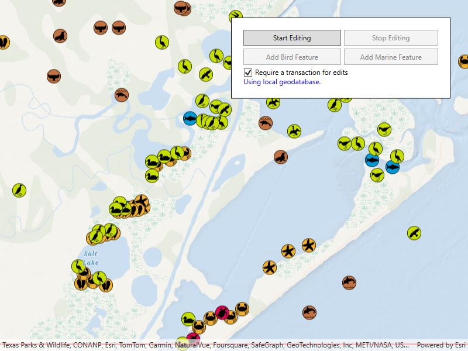

# Geodatabase transactions

Use transactions to manage how changes are committed to a geodatabase.

## Use case

Transactions allow you to control how changes are added to a database. This is useful to ensure that when multiple changes are made to a database, they all succeed or fail at once. For example, you could have a business rule that both parent/guardian and student must be added to a database used for calculating school bus routes. You can use transactions to avoid breaking the business rule if you lose power while between the steps of adding the student and parent/guardian.

## How to use the sample

Tap on the map to add multiple types of features. To apply edits directly, uncheck the "Requires Transaction". When using transactions, use the buttons to start editing and stop editing. When you stop editing, you can choose to commit the changes or roll them back.

## How it works

1. Create a `Geodatabase` using the mobile geodatabase file location.
2. Display the `Geodatabase.FeatureTables` in feature layers.
3. If a transaction is required, begin one using `Geodatabase.BeginTransaction()`.
4. Add one or more features to the feature table(s).
5. When ready, either commit the transaction to the geodatabase with `Geodatabase.CommitTransaction()` or roll back the transaction with `Geodatabase.RollbackTransaction()`.

## Relevant API

* Geodatabase
* Geodatabase.BeginTransaction
* Geodatabase.CommitTransaction
* Geodatabase.IsInTransaction
* Geodatabase.RollbackTransaction
* GeometryEditor

## Offline data

This sample downloads the [Save The Bay Geodatabase](https://www.arcgis.com/home/item.html?id=43809fd639f242fd8045ecbafd61a579) item from ArcGIS Online.

## About the data

The mobile geodatabase contains a collection schema for wildlife sightings around Christmas Bay, TX, USA. It was created using data from the [Save The Bay Feature Service](https://sampleserver6.arcgisonline.com/arcgis/rest/services/Sync/SaveTheBaySync/FeatureServer).

## Tags

commit, database, geodatabase, geometry editor, transact, transactions
