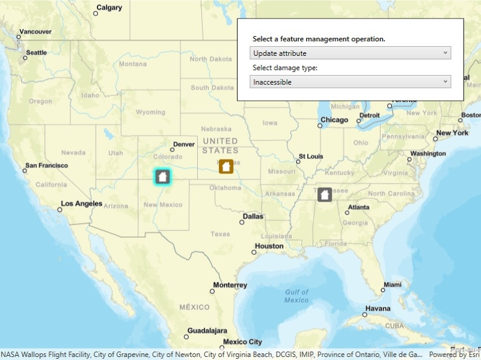

# Manage features

Create, update, and delete features to manage a feature layer.

## Use case

An end-user performing a survey may want to manage features on the map in various ways during the course of their work.

## How to use the sample

Pick an operation, then tap on the map to perform the operation at that location. Available feature management operations include: "Create feature", "Delete feature", "Update attribute", and "Update geometry".

## How it works

1. Create a `ServiceGeodatabase` from a URL.
2. Get a `ServiceFeatureTable` from the `ServiceGeodatabase`.
3. Create a `FeatureLayer` derived from the `ServiceFeatureTable` instance.
4. Update the `GeoViewTappedEvent` subscription when a feature management operation is selected.
5. Apply the feature management operation upon tapping the map.
    * Create features: create a `Feature` with attributes and a location using the `ServiceFeatureTable`.
    * Delete features: delete the selected `Feature` from the `FeatureTable`.
    * Update attribute: update the attribute of the selected `Feature`.
    * Update geometry: update the geometry of the selected `Feature`.
6. Update the `FeatureTable` locally.
7. Update the `ServiceGeodatabase` of the `ServiceFeatureTable` by calling `ApplyEditsAsync()`.
    * This pushes the changes to the server.

## Relevant API

* Feature
* FeatureEditResult
* FeatureLayer
* ServiceFeatureTable
* ServiceGeodatabase

## Additional information

When editing feature tables that are subject to database behavior (operations on one table affecting another table), it's now recommended to call these methods (apply or undo edits) on the `ServiceGeodatabase` object rather than on the `ServiceFeatureTable` object. Using the `ServiceGeodatabase` object to call these operations will prevent possible data inconsistencies and ensure transactional integrity so that all changes can be committed or rolled back.

## Tags

amend, attribute, create, delete, deletion, details, edit, editing, feature, feature layer, feature table, geodatabase, information, moving, online service, service, update, updating, value
