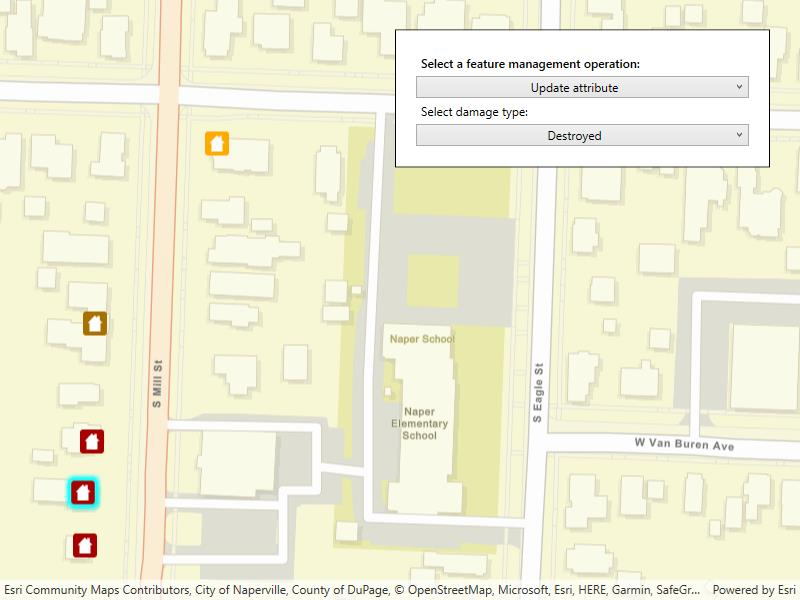

# Manage features

Manage a feature layer's features in four distinct ways.

## Use case

An end-user performing a survey may want to edit features on the map in various ways during the course of their work.

## How to use the sample

Pick a function, then tap a location on the map to perform the function at that location. Available edit functions include, "Create feature", "Delete feature", "Update attribute", and "Update geometry".

## How it works

A `Feature` instance is added to a `ServiceFeatureTable` which then pushes that new feature to the server.
	* When the table loads, you can get the domain to determine which options to present in your UI.
1. Create a `ServiceGeodatabase` from a URL.
2. Get a `ServiceFeatureTable` from the `ServiceGeodatabase`.
3. Create a `FeatureLayer` derived from the `ServiceFeatureTable` instance.
4. Create a `Picker` with four options, each representing its corresponding edit function. Selecting a new option should change the behavior of `GeoViewInputArgsEvent`.
5. Create a `Feature` with attributes and a location using the `ServiceFeatureTable`.
6. *Apply edits* intended by the selected option to the `ServiceGeodatabase` upon tapping the map.
7. After the change, update the table on the server using `ApplyEditsAsync`.

## Relevant API

* Feature
* FeatureEditResult
* FeatureLayer
* ServiceFeatureTable
* ServiceGeodatabase

## Additional information

When editing feature tables that are subject to database behavior (operations on one table affecting another table), it's now recommended to call these methods (apply edits & undo edits) on the `ServiceGeodatabase` object rather than on the `ServiceFeatureTable` object. Using the `ServiceGeodatabase` object to call these methods will prevent possible data inconsistencies and ensure transactional integrity so that all changes can be commited or rolled back.

## Tags

amend, attribute, deletion, details, edit, editing, feature, feature layer, feature table, information, moving, online service, service, updating, value
