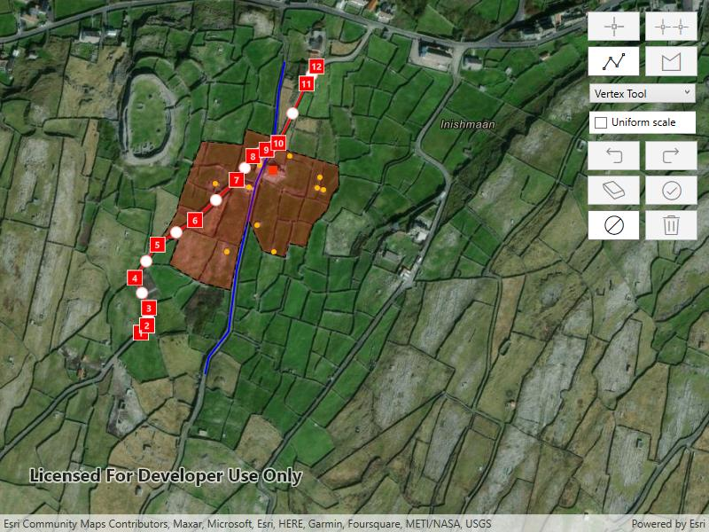

# Create and edit geometries

Use the Geometry Editor to create new point, multipoint, polyline, or polygon geometries or to edit existing geometries by interacting with a map view.

## Use case

A field worker can mark features of interest on a map using an appropriate geometry. Features such as sample or observation locations, fences or pipelines, and building footprints can be digitized using point, multipoint, polyline, and polygon geometry types. Polyline and polygon geometries can be created and edited using a vertex-based creation and editing tool (i.e. vertex locations specified explicitly via tapping), or using a freehand tool.

## How to use the sample

To create a new geometry, press the button appropriate for the geometry type you want to create (i.e. points, multipoints, polyline, or polygon) and interactively tap and drag on the map view to create the geometry. To edit an existing geometry, tap the geometry to be edited in the map and then perform edits by tapping and dragging its elements. When using an appropriate tool to select a whole geometry, you can use the control handles to scale and rotate the geometry. If creating or editing polyline or polygon geometries, choose the desired creation/editing tool (i.e. `VertexTool`, `ReticleVertexTool`, `FreehandTool`, or one of the available `ShapeTool`s).

When using the `ReticleVertexTool`, you can move the map position of the reticle by dragging and zooming the map. Insert a vertex under the reticle by tapping on the map. Move a vertex by tapping when the reticle is located over a vertex, drag the map to move the position of the reticle, then tap a second time to place the vertex.

Use the control panel to undo or redo changes made to the geometry, delete a selected element, save the geometry, stop the editing session and discard any edits, and remove all geometries from the map.

## How it works

1. Create a `GeometryEditor` and set it to the MapView using `MyMapView.GeometryEditor`.
2. Start the `GeometryEditor` using `GeometryEditor.Start(GeometryType)` to create a new geometry or `GeometryEditor.Start(Geometry)` to edit an existing geometry.
    * If using the Geometry Editor to edit an existing geometry, the geometry must be retrieved from the graphics overlay being used to visualize the geometry prior to calling the start method. To do this:
        * Use `MapView.IdentifyGraphicsOverlayAsync(...)` to identify graphics at the location of a tap.
        * Access the `MapView.IdentifyGraphicsOverlayAsync(...)`.
        * Find the desired graphic in the `results.FirstOrDefault()` list.
        * Access the geometry associated with the `Graphic` using `Graphic.Geometry` - this will be used in the `GeometryEditor.Start(Geometry)` method.
3. Create `VertexTool`, `ReticleVertexTool`, `FreehandTool`, or `ShapeTool` objects to define how the user interacts with the view to create or edit geometries, setting `GeometryEditor.Tool`.
4. Edit a tool's InteractionConfiguration to set the GeometryEditorScaleMode to allow either uniform or stretch scale mode.
5. Check to see if undo and redo are possible during an editing session using `GeometryEditor.CanUndo` and `GeometryEditor.CanRedo`. If it's possible, use `GeometryEditor.Undo()` and `GeometryEditor.Redo()`.
6. Check whether the currently selected `GeometryEditorElement` can be deleted (`GeometryEditor.SelectedElement.CanDelete`). If the element can be deleted, delete using `GeometryEditor.DeleteSelectedElement()`.
7. Call `GeometryEditor.Stop()` to finish the editing session and store the `Graphic`. The `GeometryEditor` does not automatically handle the visualization of a geometry output from an editing session. This must be done manually by propagating the geometry returned into a `Graphic` added to a `GraphicsOverlay`.
    * To create a new `Graphic` in the `GraphicsOverlay`:
        * Using `Graphic(Geometry)`, create a new Graphic with the geometry returned by the `GeometryEditor.Stop()` method.
        * Append the `Graphic` to the `GraphicsOverlay`(i.e. `GraphicsOverlay.Graphics.Add(Graphic)`).
    * To update the geometry underlying an existing `Graphic` in the `GraphicsOverlay`:
        * Replace the existing `Graphic`'s `Geometry` property with the geometry returned by the `GeometryEditor.Stop()` method.

## Relevant API

* Geometry
* GeometryEditor
* Graphic
* GraphicsOverlay
* MapView

## Additional information

The sample opens with the ArcGIS Imagery basemap centered on the island of Inis Meain (Aran Islands) in Ireland. Inis Meain comprises a landscape of interlinked stone walls, roads, buildings, archaeological sites, and geological features, producing complex geometrical relationships.

## Tags

draw, edit, freehand, geometry editor, sketch, vertex
