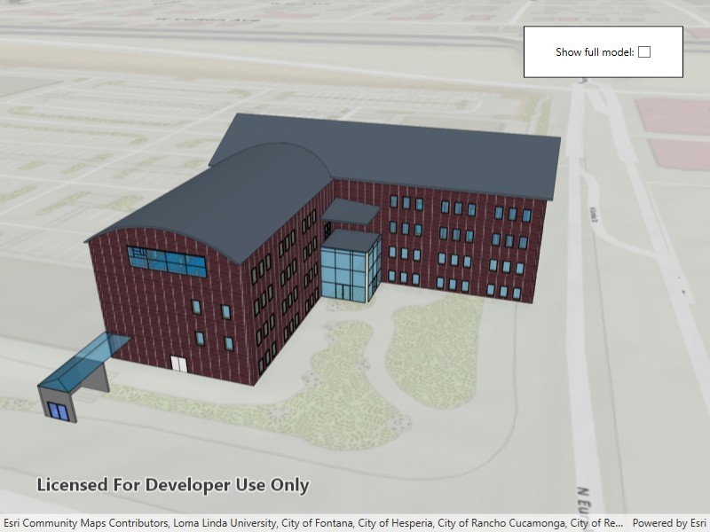

# Add building scene layer

Add a layer to a local scene to visualize and interact with 3D building models developed using Building Information Modeling (BIM) tools.

## Use case

Building Scene Layers allow you to display and analyze detailed building models created from 3D BIM data. Unlike 3D object scene layers, which represent all features within a single layer, Building Scene Layers are organized into a hierarchy of sublayers representing individual building components such as walls, light fixtures, and mechanical systems. These sublayers are often grouped by disciplines like Architectural, Mechanical, or Structural. This structure enables deeper interaction and analysis of both interior and exterior features, providing insight into how a building is designed, used, and situated in its spatial context.

## How to use the sample

When loaded, the sample displays a scene with a Building Scene Layer. By default, the Overview sublayer is visible, showing the building's exterior shell. Use the "Full Model" toggle to switch to the Full Model sublayer, which reveals the building's components. Pan around and zoom in to observe the detailed features such as walls, light fixtures, mechanical systems, and more, both outside and inside the building.

## How it works

1. Create a local scene object with the `Scene.Scene(BasemapStyle, SceneViewingMode)` constructor and `Local` viewing mode.
2. Create an `ArcGISTiledElevationSource` object and add it to the local scene's base surface.
3. Create a `BuildingSceneLayer` and add it to the local scene's operational layers.
4. Create a `LocalSceneView` object to display the scene.
5. Set the local scene to the `LocalSceneView`.

## Relevant API

* ArcGISTiledElevationSource
* BuildingSceneLayer
* BuildingSublayer
* LocalSceneView
* Scene

## Tags

3D, buildings, elevation, layers, scene, surface
