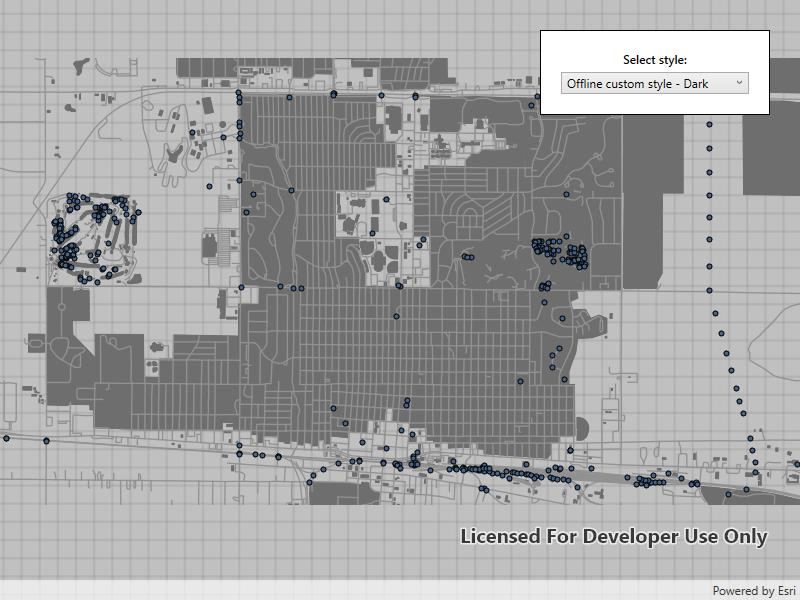

# Add vector tiled layer from custom style

Load ArcGIS vector tiled layers using custom styles.

## Use case

Vector tile basemaps can be created in ArcGIS Pro and published as offline packages or online services. You can create a custom style tailored to your needs and easily apply them to your map. The layer's colors, patterns, icons, and labels could be modified, for example.

## How to use the sample

Pan and zoom to explore the vector tile basemap.

## How it works

1. Create a `PortalItem` for each vector tiled layer.
2. Create a `Map` and set the default `Viewpoint`.
3. Export the light and dark offline custom styles.  
    i. Create a `ExportVectorTilesTask` using the portal item.  
    ii. Get the path for where the cache is being stored locally.  
    iii. Return with the cache if the path already exists.  
    iv. Else, create a `ExportVectorTilesJob` by having the task call `ExportStyleResourceCache` with the path as a parameter.  
    v. Start the job.  
    vi. When the job completes, store the result as a `ExportVectorTilesResult`.  
    vii. Return the result's item resource cache.  
4. Update the `Basemap` and `Viewpoint` when a new style is selected.

## Relevant API

* ExportVectorTilesJob
* ExportVectorTilesResult
* ExportVectorTilesTask
* VectorTileCache
* VectorTiledLayer
* VectorTilesTask

## Tags

tiles, vector, vector basemap, vector tiled layer, vector tiles
