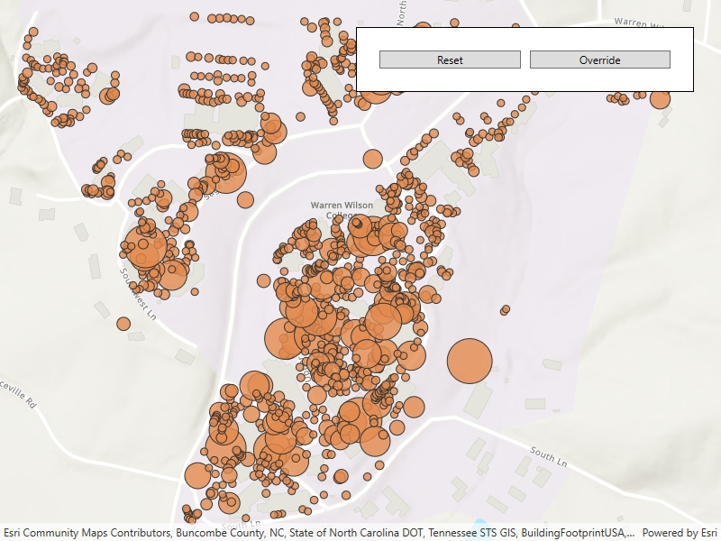

# Change feature layer renderer

Change the appearance of a feature layer with a renderer.

## Use case

A feature layer hosted on ArcGIS Online has a preset renderer and will display in an ArcGIS Maps SDK for .NET application with that renderer. However, for example, the color associated with the original renderer may be unsuitable for a company with staff or clients who are color blind, or for presentation with a different set of basemap and operational layers. In these cases, the renderer on the feature layer's data can be set to a more suitable color.

## How to use the sample

Use the button in the control panel to change the renderer on the feature layer. The original renderer displays orange circles, the diameters of which are proportional to carbon storage of each tree. When the blue renderer in this sample is applied, it displays the location of the trees simply as blue points.

## How it works

1. Create a `ServiceFeatureTable` from a URL.
2. Create a `FeatureLayer` from the service feature table.
3. Create a new renderer (in this case, a `SimpleRenderer`).
4. Change the feature layer's renderer using the `FeatureLayer.Renderer` property.

## Relevant API

* FeatureLayer.Renderer
* ServiceFeatureTable
* SimpleRenderer

## About the data

This sample displays a feature layer in Warren Wilson College, North Carolina, showing carbon storage of trees on campus. The size of each circle is proportional to that particular tree's carbon storage total.

## Tags

feature layer, renderer, visualization
