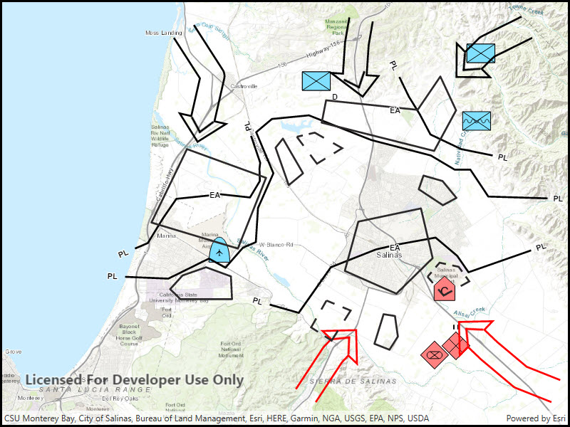

# Dictionary renderer with feature layer

Convert features into graphics to show them with mil2525d symbols.

## Use case

A dictionary renderer uses a style file along with a rule engine to display advanced symbology. 
This is useful for displaying features using precise military symbology.

## How to use the sample

Pan and zoom around the map. Observe the displayed military symbology on the map.

## How it works

1. Create a `Geodatabase` using `Geodatabase(geodatabasePath)`.
2. Load the geodatabase asynchronously using `Geodatabase.LoadAsync()`.
3. Instantiate a `SymbolDicitonary`  using `SymbolDictionary(specificationType)`.
    * `specificationType` will be the mil2525d.stylx file.
4. Load the symbol dictionary asynchronously using `DictionarySymbol.LoadAsync()`.
5. Wait for geodatabase to completely load.
6. Cycle through each `GeodatabaseFeatureTable` from the geodatabase using `Geodatabase.GeodatabaseFeatureTables`.
7. Create a `FeatureLayer` from each table within the geodatabase using `FeatureLayer(GeodatabaseFeatureTable)`.
8. Load the feature layer asynchronously with `FeatureLayer.LoadAsync()`.
9. Wait for each layer to load.
10. After the last layer has loaded, then create a new `Envelope` from a union of the extents of all layers.
    * Set the envelope to be the `Viewpoint` of the map view using `MapView.SetViewpoint(new Viewpoint(Envelope))`.
11. Add the feature layer to map using `Map.OperationalLayers.Add(FeatureLayer)`.
12. Create `DictionaryRenderer(SymbolDictionary)` and attach to the feature layer.

## Relevant API

* DictionaryRenderer
* SymbolDictionary

## Offline data

This sample downloads the following items from ArcGIS Online automatically:

* [mil2525d.stylx](https://www.arcgis.com/home/item.html?id=e34835bf5ec5430da7cf16bb8c0b075c) - A stylx file for building custom applications that incorporate the MIL-STD-2525D symbol dictionary. 
* [militaryoverlay.geodatabase.zip](https://www.arcgis.com/home/item.html?id=e0d41b4b409a49a5a7ba11939d8535dc) - This is a mobile geodatabase created from the Military Overlay template for use in ArcGIS Maps SDK for Native Apps samples

## Tags

military, symbol