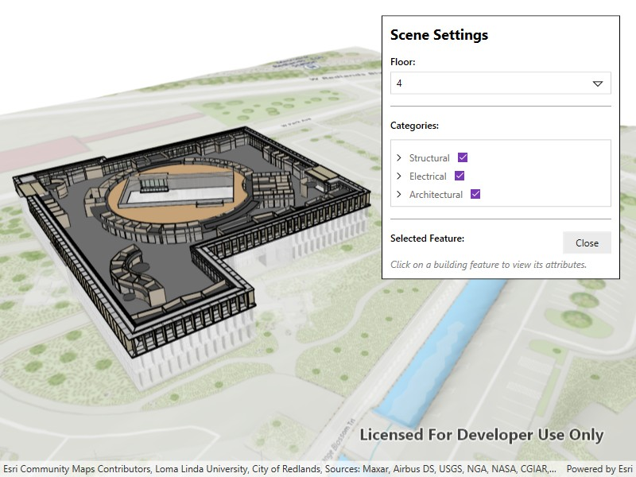

# Filter building scene layer

Explore details of a building scene by using filters and sublayer visibility.

## Use case

Buildings and their component parts (in this example, structural, electrical, or architectural) can be difficult to explain and visualize. An architectural firm might share a 3D building model visualization with clients and contractors to let them explore these components by floor and component type.

## How to use the sample

Once the scene is loaded, click the "Building Filter Settings" button to view the filtering options.

* Select a floor from the "Floor" menu to view the internal details of each floor or "All" to view the entire model. Selecting a floor applies a filter that hides all floors above the selected floor and gives the floors below a transparent, X-ray renderer.
* Expand the categories under the top-level disciplines to show or hide individual categories in the building model. The entire discipline may be shown or hidden as well.
* Click on any features in the building to view the attributes of the feature.

## How it works

1. Create a `Scene` with the URL to a Building Scene Layer service.
2. Create a `LocalSceneView` and add the scene.
3. Retrieve the `BuildingSceneLayer` from the scene's operational layers.
4. When a floor is selected:
    1. A new `BuildingFilter` is created with two `BuildingFilterBlock` items.
    2. One block defines the solid renderer for features on the selected floor.
    3. The second block defines the X-ray filter for features on the floors below the selected floor.
    4. Features that exist on floors above the selected floor are not rendered.
    5. If "All" is selected, the `ActiveFilter` property on the building scene layer is set to `null` so all features are rendered according to their default settings.
5. Architectural disciplines and categories are represented by `BuildingGroupSublayer` and `BuildingSublayer` objects containing features within a building scene layer. When checked or unchecked, the visibility of the group or sublayer is set to true (visible) or false (hidden).
6. When a building feature is clicked on:
    1. A call to `IdentifyLayerAsync` on the `LocalSceneView` is initiated based on the screen offset of the click.
    2. The `SublayerResults` property of the returned `IdentifyLayerResult` will contain the identified features. Note that the building scene layer features are NOT returned in the `GeoElements` property of the results.
    3. The details of the first identified feature are shown in a popup.

## Relevant API

* BuildingComponentSublayer
* BuildingFilter
* BuildingFilterBlock
* BuildingSceneLayer
* LocalSceneView
* Scene

## About the data

This sample uses the [Esri Building E Local Scene](https://www.arcgis.com/home/item.html?id=b7c387d599a84a50aafaece5ca139d44) web scene, which contains a Building Scene Layer representing Building E on the Esri Campus in Redlands, CA. The Revit BIM model was brought into ArcGIS using the BIM capabilities in ArcGIS Pro and published to the web as a Building Scene Layer.

## Additional information

Buildings in a Building Scene Layer can be very complex models composed of sublayers containing internal and external features of the structure. Sublayers may include structural components like columns, architectural components like floors and windows, and electrical components.

Applying filters to the Building Scene Layer can highlight features of interest in the model. Filters are made up of filter blocks, which contain several properties that allow control over the filter's function. Setting the filter mode to X-Ray, for instance, will render features with a semi-transparent white color so other interior features can be seen. In addition, toggling the visibility of sublayers can show or hide all the features of a sublayer.

## Tags

3D, building scene layer, layers
