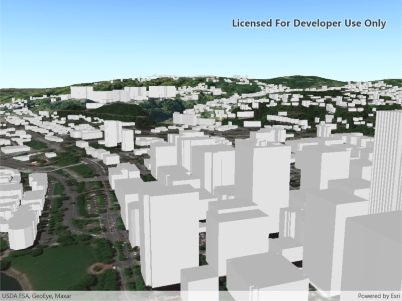

# Scene layer (URL)

Display an ArcGIS scene layer from a URL.

## Use case

Adding a scene layer from a URL allows you to author the scene layer elsewhere in the platform, say with ArcGIS Pro or CityEngine, and then add that scene layer to a scene in Runtime. Loading a scene layer from a URL also permits the layer source to change dynamically without updating the code.

## How to use the sample

Pan and zoom to explore the scene.

## How it works

1. Create an `ArcGISSceneLayer` passing in the URL to a scene layer service.
2. Wait for the user to tap with the `sceneView.GeoViewTapped` event and get the tapped screen point.
3. Call `sceneView.IdentifyLayersAsync(sceneLayer, screenPoint, tolerance, false, 1)` to identify features in the scene.
4. From the resulting `IdentifyLayerResult`, get the list of identified `GeoElements` with `result.GeoElements`.
5. Get the first element in the list, checking that it is a feature, and call `sceneLayer.SelectFeature(feature)` to select it.

## Relevant API

* ArcGISScene
* ArcGISSceneLayer
* SceneView

## About the data

This sample shows a [Portland, Oregon USA Scene](https://www.arcgis.com/home/item.html?id=2b721b9e7bef45e2b7ff78a398a33acc) hosted on ArcGIS Online.

## Tags

3D, buildings, model, Portland, scene, service, URL
