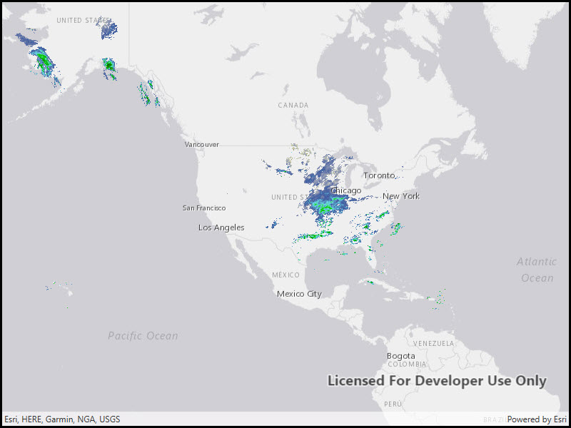

# WMS layer (URL)

Display a WMS layer using a WMS service URL.

## Use case

WMS is an OGC standard for displaying maps from images that are dynamically-generated on a web server. WMS is particularly useful for data that changes frequently, contains cartographically complex detail, or requires an open source data standard.

## How to use the sample

The map will load automatically when the sample starts.

## How it works

1. Create a `WmsLayer` specifying the URL of the service and the names of layers you want to display.
    * **Note**: The name comes from the `Name` property, not the `Title` property. On many services, the title is human-readable while the name is a numeric identifier.
2. Add the layer to the map as an operational layer.

## Relevant API

* Map
* MapView
* WmsLayer

## About the data

This sample uses the WMS service behind the [U.S. National Weather Service radar map](https://nowcoast.noaa.gov/geoserver/observations/weather_radar/wms?SERVICE=WMS&REQUEST=GetCapabilities). Because WMS services generate map images on-the-fly, this layer is always up-to-date with the latest NOAA nowCOAST real-time coastal observations, forecasts, and warnings.

## Tags

layer, OGC, web map service, WMS
