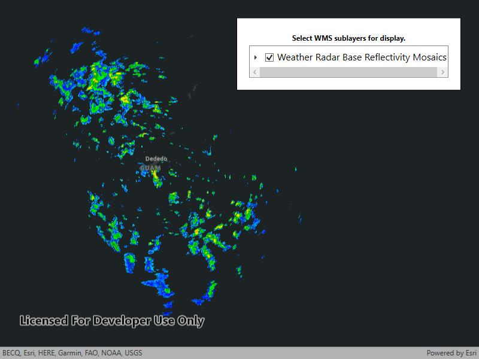

# WMS service catalog

Connect to a WMS service and show the available layers and sublayers.

## Use case

WMS services often contain many layers and sublayers. Presenting the layers and sublayers in a UI allows you to explore what is available in the service and add individual layers to a map.

## How to use the sample

1. Open the sample. A hierarchical list of layers and sublayers will appear.
2. Select a layer to enable it for display. If the layer has any children, the children will also be selected.

## How it works

1. A `WmsService` is created and loaded.
2. `WmsService` has a `ServiceInfo` property, which is a `WmsServiceInfo`. `WmsServiceInfo` has a `WmsLayerInfo` object for each layer (excluding sublayers) in the `LayerInfos` collection.
3. A method is called to recursively discover sublayers for each layer. Layers are wrapped in a view model and added to a list.
    * The view model has a `Select` method which recursively selects or deselects itself and sublayers.
    * The view model tracks the children and parent of each layer.
4. Once the layer selection has been updated, another method is called to create a new `WmsLayer` from a list of selected `WmsLayerInfo`.

## Relevant API

* WmsLayer(List<WmsLayerInfo>)
* WmsLayerInfo
* WmsService
* WmsServiceInfo

## About the data

This sample shows [forecasts guidance warnings](https://nowcoast.noaa.gov/geoserver/weather_radar/wms?SERVICE=WMS&VERSION=1.3.0&REQUEST=GetCapabilities) from an ArcGIS REST service produced by the US NOAA National Weather Service. The map shows fronts, highs, and lows, as well as areas of forecast precipitation.

## Tags

catalog, OGC, web map service, WMS
