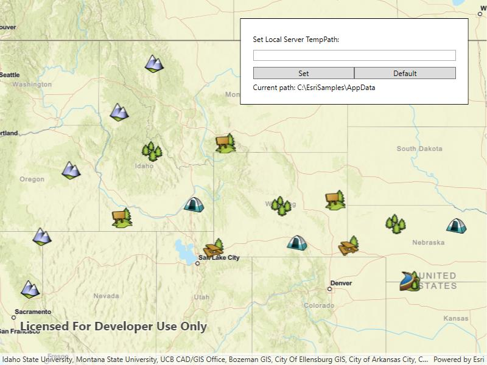

# Local server feature layer

Start a local feature service and display its features in a map.

## Use case

For executing offline geoprocessing tasks in your applicationss via an offline (local) server.

## How to use the sample

A Local Server and Local Feature Service will automatically be started. Once started then a `FeatureLayer` will be created and added to the map.

## How it works

1. Create and run a local server with `LocalServer.Instance`.
2. Start the server asynchronously with `Server.StartAsync()`.
3. Create and run a local feature service.
   1. Instantiate `LocalFeatureService(Url)` to create  a local feature service with the given url path to mpk file.
   2. Start the service asynchronously with `LocalFeatureService.StartAsync()`. The service will be added to the local server automatically.
1. Create an event handler for the `LocalFeatureService.StatusChanged` event. This will run whenever the status of the local service has changed.
2. When the service's status has changed to `Started`, create a feature layer from local feature service.
   1. Create a `ServiceFeatureTable(Url)` using the URL for the feature layer.
   2. Create feature layer from service feature table using `new FeatureLayer(ServiceFeatureTable)`.
   3. Load the layer asynchronously using `FeatureLayer.LoadAsync()`.
3. Add feature layer to map using `Map.OperationalLayers.Add(FeatureLayer)`.

## Relevant API

* FeatureLayer
* LocalFeatureService
* LocalServer
* LocalServerStatus
* StatusChangedEvent

## Offline data

This sample downloads the following items from ArcGIS Online automatically:

* [PointsofInterest.mpkx](https://www.arcgis.com/home/item.html?id=92ca5cdb3ff1461384bf80dc008e297b) - This map package is included in the ArcGIS sample data.

## Additional information

ArcGIS Maps SDK for Local Server (Local Server) is deprecated and will be retired in 2030. The last release will be ArcGIS Maps SDK for Local Server 200.8, in Q3 2025. For more information, see the [deprecation announcement](https://support.esri.com/en-us/knowledge-base/deprecation-arcgis-maps-sdk-for-local-server-000034908).

## Tags

feature service, local, offline, server, service