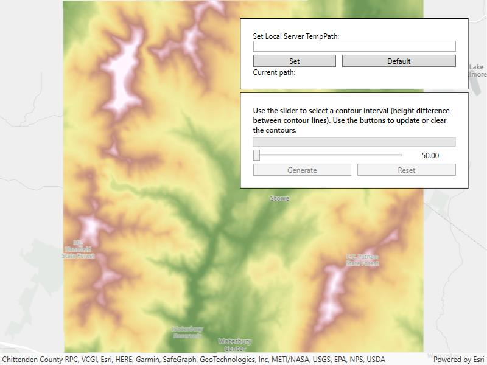

# Local server geoprocessing

Create contour lines from local raster data using a local geoprocessing package `.gpk` and the contour geoprocessing tool.

## Use case

For executing offline geoprocessing tasks in your apps via an offline (local) server.

## How to use the sample

Contour Line Controls (Top Left):

* Interval - Specifies the spacing between contour lines.
* Generate Contours - Adds contour lines to map using interval.
* Clear Results - Removes contour lines from map.

## How it works

1. Create and run a local server with `LocalServer.Instance`.
2. Start the server asynchronously with `server.StartAsync()`.
3. Start a `LocalGeoprocessingService` and run a `GeoprocessingTask`.
    1. Instantiate `LocalGeoprocessingService(Url, ServiceType)` to create a local geoprocessing service.
    2. Call `LocalGeoprocessingService.StartAsync()` to start the service asynchronously.
    3. Instantiate `GeoprocessingTask(LocalGeoprocessingService.Url + "/Contour")` to create a geoprocessing task that uses the contour lines tool.
4. Create an instance of `GeoprocessingParameters`.
    1. Instantiate `GeoprocessingParameters(ExecutionType)` creates geoprocessing parameters.
    2. Create a parameter using `gpParams.Inputs["ContourInterval"] = new GeoprocessingDoublevalue)` using the desired contour value.
5. Create and start a `GeoprocessingJob` using the previous parameters.
    1. Create a geoprocessing job with `GeoprocessingTask.CreateJob(GeoprocessingParameters)`.
    2. Start the job with `GeoprocessingJob.Start()`.
6. Add contour lines as an `ArcGISMapImageLayer` to the map.
    1. Get url from local geoprocessing service using the `service.Url` property.
    2. Get server job id of geoprocessing job using the `GeoprocessingJob.ServerJobId` property.
    3. Replace `GPServer` from url with `MapServer/jobs/jobId`, to get generate contour lines data.
    4. Create a map image layer from that new url and add that layer to the map.

## Relevant API

* GeoprocessingDouble
* GeoprocessingJob
* GeoprocessingParameter
* GeoprocessingParameters
* GeoprocessingTask
* LocalGeoprocessingService
* LocalGeoprocessingService.ServiceType
* LocalServer
* LocalServerStatus

## Offline data

This sample downloads the following items from ArcGIS Online automatically:

* [Contour.gpkx](https://www.arcgis.com/home/item.html?id=a680362d6a7447e8afe2b1eb85fcde30) - A Geoprocessing Package for generating contour lines.
* [RasterHillshade.tpkx](https://www.arcgis.com/home/item.html?id=3f38e1ae7c5948cc95334ba3a142a4ec) - A tile package for the hillshade.

## Additional information

ArcGIS Maps SDK for Local Server (Local Server) is deprecated and will be retired in 2030. The last release will be ArcGIS Maps SDK for Local Server 200.8, in Q3 2025. For more information, see the [deprecation announcement](https://support.esri.com/en-us/knowledge-base/deprecation-arcgis-maps-sdk-for-local-server-000034908).

## Tags

geoprocessing, local, offline, parameters, processing, service