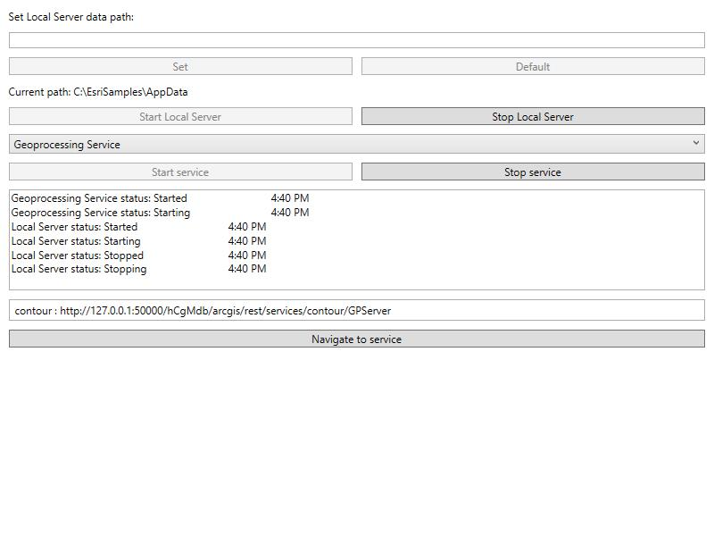

# Local server services

Demonstrates how to start and stop the Local Server and start and stop a local map, feature, and geoprocessing service running on the Local Server.

## Use case

For executing offline geoprocessing tasks in your apps via an offline (local) server.

## How to use the sample

Click `Start Local Server` to start the Local Server. Click `Stop Local Server` to stop the Local Server.

The `Map Service` control lets you to pick a local service that is available.

After browsing for the desired file, click `Start Service` to start the selected service.

When the running service's url appears, select it and click `Navigate to service`. To stop this running service, click `Stop Service`.

## How it works

To start a `LocalServer` and attach a `LocalService`:

1. Create and run a local server with `LocalServer.Instance`.
2. Start the server asynchronously with `server.StartAsync()`.
3. Create and run a local service. Here is an example of running a `LocalMapService`:
    1. Instantiate `LocalMapService(Url)` to create a local map service with the given URL path to map package (`mpk` or `mpkx` file).
    2. Start the job with `LocalMapService.StartAsync()`. The service is added to the `LocalServer` automatically.
4.  Stop the local server with `LocalServer.Instance.StopAsync()`.

## Relevant API

* LocalFeatureService
* LocalGeoprocessingService
* LocalMapService
* LocalServer
* LocalServerStatus
* LocalService

## Offline data

* [Contour.gpkx](https://www.arcgis.com/home/item.html?id=a680362d6a7447e8afe2b1eb85fcde30) - A Geoprocessing Package for generating contour lines.
* [PointsofInterest.mpkx](https://www.arcgis.com/home/item.html?id=92ca5cdb3ff1461384bf80dc008e297b)
* [RelationshipID.mpkx](https://www.arcgis.com/home/item.html?id=85c34847bbe1402fa115a1b9b87561ce)

## Additional information

Local Server can be downloaded for Windows and Linux platforms from the [developers website](https://developers.arcgis.com/downloads/apis-and-sdks?product=local-server#arcgis-runtime-local-server). Local Server is not supported on macOS.

## Tags

feature, geoprocessing, local services, map, server, service
