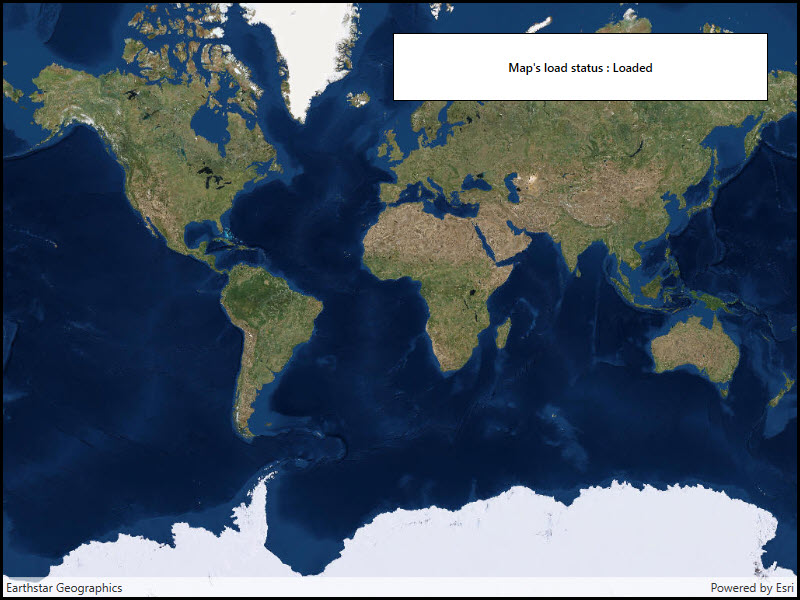

# Map load status

Determine the map's load status which can be: `NotLoaded`, `FailedToLoad`, `Loading`, `Loaded`.

## Use case

Knowing the map's load state may be required before subsequent actions can be executed.

## How to use the sample

The load status of the map will be displayed as the sample loads.

## How it works

1. Create a `Map` and add it to a `MapView`.
2. Use the `Map.LoadStatusChanged` event to listen for changes in the map's load status.

The `LoadStatus` is `Loaded` when any of the following criteria are met:

* The map has a valid spatial reference.
* The map has an an initial viewpoint.
* One of the map's predefined layers has been created.

## Relevant API

* ILoadable
* Map
* MapView

## Tags

load status, loadable pattern, map
