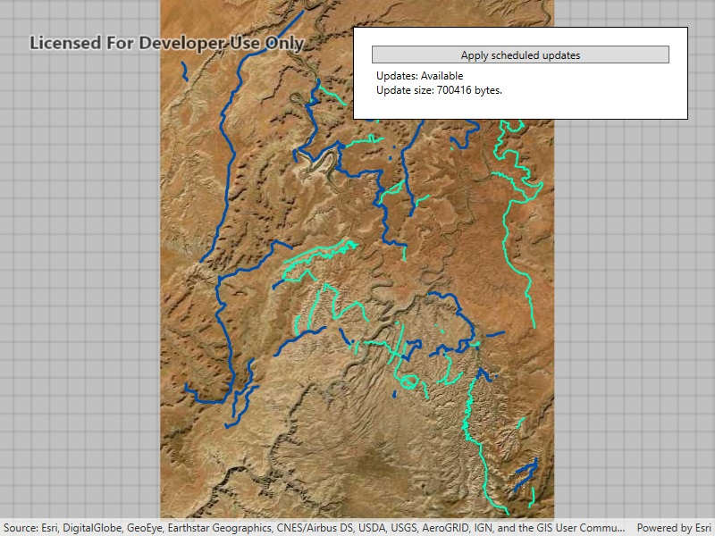

# Apply scheduled updates to preplanned map area

Apply scheduled updates to a downloaded preplanned map area.

## Use case

With scheduled updates, the author can update the features within the preplanned areas on the service once, and multiple end-users can request these updates to bring their local copies up to date with the most recent state. Importantly, any number of end-users can download the same set of cached updates which means that this workflow is extremely scalable for large operations where you need to minimize load on the server.

This workflow can be used by survey workers operating in remote areas where network connectivity is not available. The workers could download mobile map packages to their individual devices and perform their work normally. Once they regain internet connectivity, the mobile map packages can be updated to show any new features that have been added to the online service.

## How to use the sample

Start the app. It will display an offline map, check for available updates, and show update availability and size. Select 'Apply Updates' to apply the updates to the local offline map and show the results.

## How it works

1. Create an `OfflineMapSyncTask` with your offline map.
2. If desired, get `OfflineMapUpdatesInfo` from the task to check for update availability or update size.
3. Get a set of default `OfflineMapSyncParameters` for the task.
4. Set the parameters to download all available updates.
5. Use the parameters to create an `OfflineMapSyncJob`.
6. Start the job and get the results once it completes successfully.
7. Check if the mobile map package needs to be reopened, and do so if necessary.
8. Finally, display your offline map to see the changes.

## Relevant API

* MobileMapPackage
* OfflineMapSyncJob
* OfflineMapSyncParameters
* OfflineMapSyncResult
* OfflineMapSyncTask
* OfflineMapUpdatesInfo

## Offline data

This sample uses a [mobile map package](https://arcgisruntime.maps.arcgis.com/home/item.html?id=740b663bff5e4198b9b6674af93f638a), which can be found on ArcGIS Online.

The `DataManager` class is used download data from an ArcGIS Online portal item to the local application data folder. Most samples use a call from the sample viewer code to download the data before starting the sample. The data is not re-downloaded if the sample is opened again. This sample uses `DataManager` to delete the mobile map package data (if present) and download it again. Applying updates to the map package changes the offline data, so that data must be refreshed every time this sample is opened.

## About the data

The data in this sample shows the roads and trails in the Canyonlands National Park, Utah. Data by [U.S. National Parks Service](https://public-nps.opendata.arcgis.com/). No claim to original U.S. Government works.

## Additional information

**Note:** preplanned areas using the Scheduled Updates workflow are read-only. For preplanned areas that can be edited on the end-user device, see the [Download preplanned map area](https://developers.arcgis.com/net/wpf/sample-code/download-preplanned-map-area/) sample. For more information about offline workflows, see [Offline maps, scenes, and data](https://developers.arcgis.com/documentation/mapping-apis-and-location-services/offline/) in the *ArcGIS Developers* guide.

## Tags

offline, pre-planned, preplanned, synchronize, update
