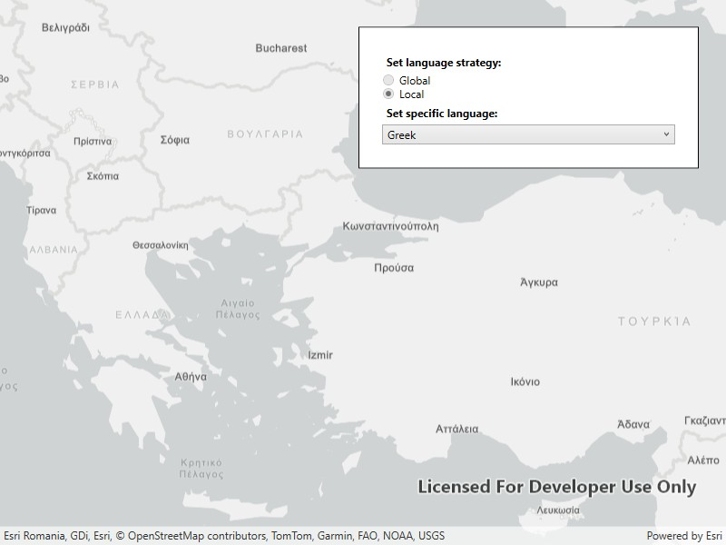

# Configure basemap style parameters

Apply basemap style parameters customization for a basemap, such as displaying all labels in a specific language or displaying every label in their corresponding local language.

## Use case

When creating an application that's used in multiple countries, basemaps can reflect the languages and cultures of the users' location. For example, if an application user is in Greece, displaying the labels on a basemap in Greek reflects the local language. Customizing the language setting on the basemap can be controlled by an application user (such as by setting preferences), or implicitly managed within the application logic (by querying the locale of the platform running the application).

## How to use the sample

This sample showcases the workflow of configuring basemap style parameters by displaying a basemap with labels in different languages and launches with a `Viewpoint` set over Bulgaria, Greece and Turkey, as they use three different alphabets: Cyrillic, Greek, and Latin, respectively. By default, the `BasemapStyleLanguageStrategy` is set to `Local` which displays all labels in their corresponding local language. This can be changed to `Global`, which displays all labels in English. The `SpecificLanguage` setting sets all labels to a selected language and overrides the `BasemapStyleLanguageStrategy` settings.

Pan and zoom to navigate the map and see how different labels are displayed in these countries depending on the selected `BasemapStyleLanguageStrategy` and `SpecificLanguage`: all English, all Greek, all Bulgarian, all Turkish, or each their own.

## How it works

1. Create a `BasemapStyleParameters` object.
2. Configure customization preferences on the `BasemapStyleParameters` object, for instance:
    * setting the `LanguageStrategy` to `BasemapStyleLanguageStrategy.Local` or
    * setting the `SpecificLanguage` to a `new CultureInfo("el")` changes the label language to Greek.
3. The `SpecificLanguage` always overrides the `LanguageStrategy`, which means the specific language needs to be set to an empty string in order to use the language strategy.
4. Create a basemap using a `BasemapStyle` and the `BasemapStyleParameters`.
5. Assign the configured basemap to the `Map`'s `Basemap` property.
6. To modify the basemap style, for example if you want to change your preferences, repeat the above steps.

## Relevant API

* Basemap
* BasemapStyleLanguageStrategy
* BasemapStyleParameters
* Map
* MapView

## About the data

The main data for this sample is the `BasemapStyle` which include basemaps that support both language localization and global language setting. The supported languages, along with their language code, can be found in the [API's documentation](https://developers.arcgis.com/rest/basemap-styles/#languages).

## Tags

basemap style, language, language strategy, map, point, viewpoint
