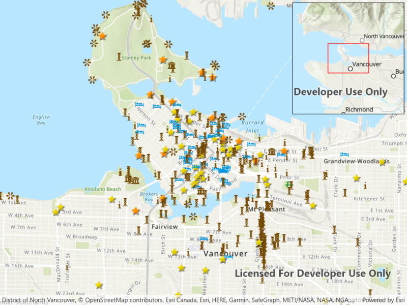

# Display overview map

Include an overview or inset map as an additional map view to show the wider context of the primary view.

## Use case

An overview map provides a useful, smaller-scale overview of the current map view's location. For example, when you need to inspect a layer with many features while remaining aware of the wider context of the view, use an overview map to help show the extent of the main map view.

## How to use the sample

Pan or zoom across the map view to browse through the tourist attractions feature layer and notice the viewpoint and scale of the linked overview map update automatically. When running the sample on a desktop, you can also navigate by panning and zooming on the overview map. However, interactivity of the overview map is disabled on mobile devices.

## How it works

1. Create a `Map` with the `ArcGISTopographic` basemap style and add it to the `MapView`.
2. Instantiate a `FeatureLayer` from a `ServiceFeatureTable` and append it to the `Map`'s operational layers.
3. In the user-interface, declare an `OverviewMap` object from the ArcGIS Maps SDK for .NET Toolkit.
4. Assign the `MapView` to the `MyOverviewMap.GeoView` property of the `OverviewMap` to connect the `MapView` with the `OverviewMap`.
5. Set the scale factor of the `OverviewMap` with the `MyOverviewMap.ScaleFactor`.

## Relevant API

* MapView
* OverviewMap

## About the data

The data used in this sample is the [OpenStreetMap Tourist Attractions for North America](https://www.arcgis.com/home/item.html?id=97ceed5cfc984b4399e23888f6252856) feature layer, which is scale-dependent and displays at scales larger than 1:160,000.

## Additional information

 This sample uses the overview map toolkit component which can be accessed using the Esri.ArcGISRuntime.Toolkit nuget package. The [toolkit](https://github.com/Esri/arcgis-toolkit-dotnet) can also be cloned and set up locally. For information about setting up the toolkit, visit the [repository](https://github.com/Esri/arcgis-toolkit-dotnet/blob/main/README.md).

## Tags

context, inset, map, minimap, overview, preview, small scale, toolkit, view
