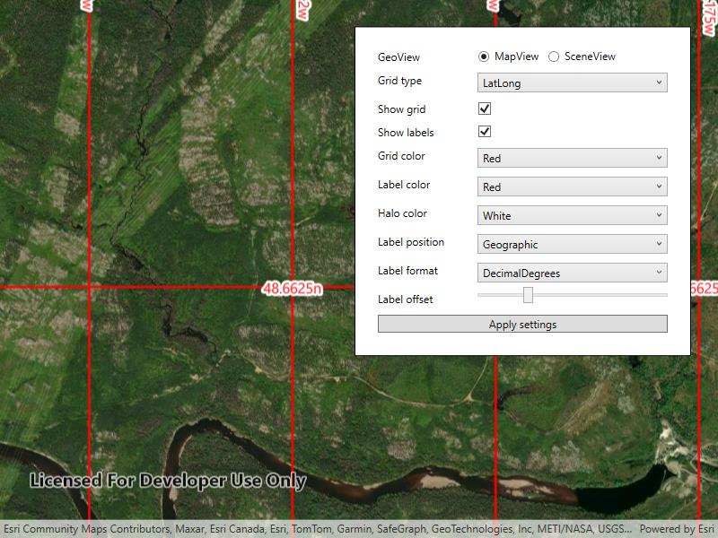

# Display grid

Display and customize coordinate system grids including Latitude/Longitude, MGRS, UTM and USNG on a map view or scene view.

## Use case

Grids are often used on printed maps, but can also be helpful on digital 2D maps or 3D scenes, to identify locations.

## How to use the sample

Use the controls to change the grid settings. You can change the view from 2D or 3D, select the type of grid from `Grid Type` (LatLong, MGRS, UTM, and USNG) and modify its properties like label visibility, grid line color, grid label color, label formatting, and label offset.

## How it works

1. Create an instance of one of the `Grid` types.
2. Grid lines and labels can be styled per grid level with `setLineSymbol(gridLevel, lineSymbol)` and `setTextSymbol(gridLevel, textSymbol)` methods on the grid.
3. The label position can be set with `setLabelPosition(labelPosition)` method on the grid.
   * Note that as of 200.6, MGRS, UTM, and USNG grids in a SceneView only support the `Geographic` label position.
4. For the `LatitudeLongitudeGrid` type, you can specify a label format of `DECIMAL_DEGREES` or `DEGREES_MINUTES_SECONDS`.
5. For all screen-aligned label placement strategies, you can set the labels' offset in device-independent pixels (DIPs) from the screen edge with `setLabelOffset(offset)`.
6. To set the grid, use the `setGrid(grid)` method on the map view or scene view.

## Relevant API

* Grid
* LatitudeLongitudeGrid
* MapView
* MGRSGrid
* SceneView
* SimpleLineSymbol
* TextSymbol
* USNGGrid
* UTMGrid

## Tags

coordinates, degrees, graticule, grid, latitude, longitude, MGRS, minutes, seconds, USNG, UTM
