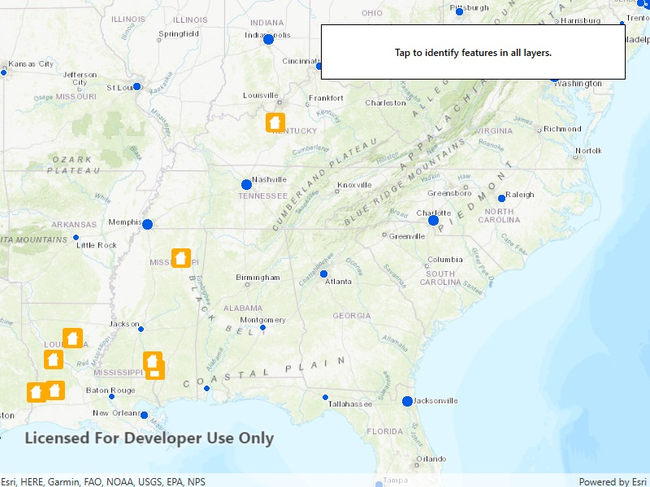

# Identify layers

Identify features in all layers in a map.

## Use case

`IdentifyLayers` allows users to click on a map, returning features at that location across multiple layers. Because some layer types have sublayers, the sample recursively counts results for sublayers within each layer.

## How to use the sample

Tap to identify features. An alert will show all layers with features under the cursor, as well as a layer count.

## How it works

1. The tapped position is passed to `MapView.IdentifyLayersAsync`
2. For each `IdentifyLayerResult` in the results, features are counted.
    * Note: there is one identify result per layer with matching features; if the feature count is 0, that means a sublayer contains the matching features.

## Relevant API

* IdentifyLayerResult
* IdentifyLayerResult.LayerContent.Name
* IdentifyLayerResult.SublayerResults
* MapView.IdentifyLayersAsync

## Additional information

The GeoView supports two methods of identify: `IdentifyLayerAsync()`, which identifies features within a specific layer and `IdentifyLayersAsync()`, which identifies features for all layers in the current view.

## Tags

identify, recursion, recursive, sublayers
