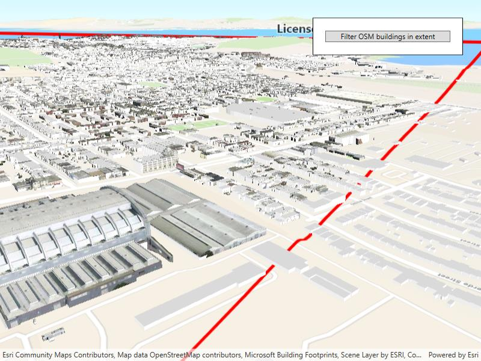

# Filter features in scene

Filter 3D scene features out of a given geometry with a polygon filter.

## Use case

You can directly control what users see within a specific scene view to give a more focused or cleaner user experience by using a `SceneLayerPolygonFilter` to selectively show or hide scene features within a given area.

## How to use the sample

The sample initializes showing the 3D buildings OpenStreetMap layer. Click the "Load detailed buildings" button to load an additional scene layer that contains more detailed buildings. Notice how the two scene layers overlap and clip into each other. Click the "Filter OSM buildings in extent" button, to set a `SceneLayerPolygonFilter` and filter out the OpenStreetMap buildings within the extent of the detailed buildings scene. Notice how the OSM buildings within and intersecting the extent of the detailed buildings layer are hidden. Click the "Reset scene" button to hide the detailed buildings scene layer and clear the OSM buildings filter.

## How it works

1. Add `BaseLayers` to a `Basemap` for the scene using a topographic `ArcGISVectorTileLayer` and the OpenStreetMap 3D Buildings `ArcGISSceneLayer` as baselayers.
2. Create a `Surface` for the scene and set the World Elevation 3D as an elevation source.
3. Add the 3D San Francisco Buildings `ArcGISSceneLayer` to the scene's operational layers.
4. Construct a `SceneLayerPolygonFilter` with the extent of the San Francisco Buildings Scene Layer and the `SceneLayerPolygonFilterSpatialRelationship.Disjoint` enum to hide all features within the extent.
5. Set the `SceneLayerPolygonFilter` on the OSM Buildings layer to hide all OSM buildings within the extent of the San Francisco Buildings layer.

## Relevant API

* ArcGISSceneLayer
* SceneLayerPolygonFilter
* SceneLayerPolygonFilterSpatialRelationship

## About the data

This sample uses the [OpenStreetMap 3D Buildings](https://www.arcgis.com/home/item.html?id=ca0470dbbddb4db28bad74ed39949e25) which provides generic 3D outlines of buildings throughout the world. It is based on the OSM Daylight map distribution and is hosted by Esri. It uses the [San Francisco 3D Buildings](https://www.arcgis.com/home/item.html?id=d3344ba99c3f4efaa909ccfbcc052ed5) scene layer which provides detailed 3D models of buildings in San Francisco, California, USA.

## Additional information

This sample uses `SceneLayerPolygonFilterSpatialRelationship.Disjoint` to hide all features within the extent of the given geometry. You can alternatively use the `SceneLayerPolygonFilterSpatialRelationship.Contains` enum to only show features within the extent of the geometry.

You can also show or hide features in a scene layer using `ArcGISSceneLayer.SetFeatureVisible()` or `SetFeaturesVisible()` and pass in a feature or list of features and a boolean value to set their visibility.

## Tags

3D, buildings, disjoint, exclude, extent, filter, hide, OSM, polygon
