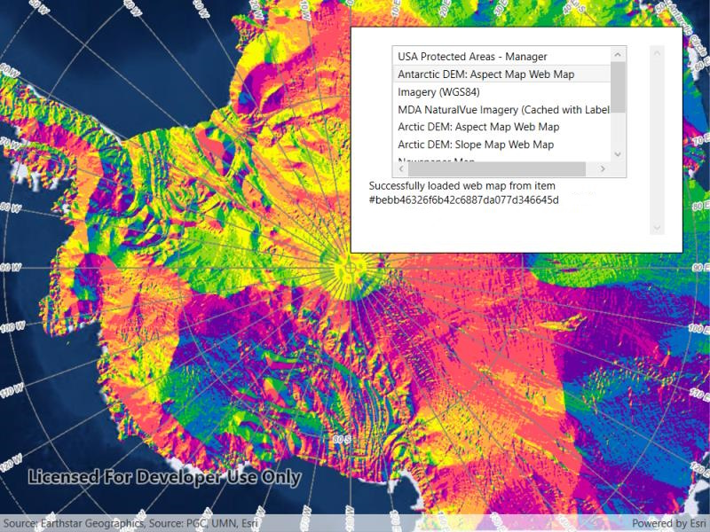

# Integrated Windows Authentication

Connect to an IWA secured Portal and search for maps.

## Use case

Your organization might use Integrated Windows Authentication (IWA) to secure ArcGIS Enterprise. This can be useful because the same credentials used to log into your work computer and network can be used to authenticate with ArcGIS. IWA is built into Microsoft Internet Information Server (IIS) and works well for intranet applications but isn't always practical for internet apps.

## How to use the sample

1. Enter the URL to your IWA-secured portal.
2. Click the button to search for web maps stored on the portal.
3. If authentication is successful, portal items will display in the list.

## How it works

1. The currently logged in Windows account will be used to authenticate portal access.
2. An `ArcGISNetworkCredential` object is created.
3. If the user authenticates, the search returns a list of web maps (`ArcGISPortalItem`).

## Relevant API

* ArcGISNetworkCredential
* ArcGISPortal

## About the data

This sample searches for web map portal items on a secure portal. To successfully run the sample, you need access to a portal secured with Integrated Windows Authentication that contains one or more web map items and credentials which grants you access to that portal.

## Additional information

IWA, which is built into Microsoft Internet Information Server (IIS), works well for intranet applications but isn't always practical for internet apps.

More information about IWA and its use with ArcGIS can be found at the following links:

* [IWA - Wikipedia](https://en.wikipedia.org/wiki/Integrated_Windows_Authentication)
* [Use Integrated Windows Authentication with your portal](http://enterprise.arcgis.com/en/portal/latest/administer/windows/use-integrated-windows-authentication-with-your-portal.htm)

## Tags

authentication, Portal, security, Windows
