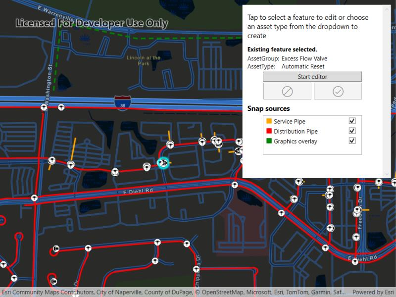

# Snap geometry edits with utility network rules

Use the Geometry Editor to edit geometries using utility network rules.

## Use case

A field worker can create new features by editing and snapping the vertices of a geometry to existing features on a map. In a gas utility network, gas pipeline features can be represented with the polyline geometry type. By interpreting utility network rules when snapping, proposed features can be snapped to valid pipelines based on connectivity rules.

## How to use the sample

To create a geometry, choose an asset type from the dropdown menu and click the button to start the geometry editor.

To edit a geometry, tap a point geometry to be edited in the map to select it and then edit the geometry by clicking the button to start the geometry editor.

Snap settings can be configured by enabling and snap sources.

To interactively snap a vertex to a feature or graphic, ensure that snapping is enabled for the relevant snap source and move the mouse pointer or drag a vertex to nearby an existing feature or graphic. If the existing feature or graphic has valid utility network connectivity rules for the asset type that is being created or edited the edit position will be adjusted to coincide with (or snap to), edges and vertices of its geometry. Click or release the touch pointer to place the vertex at the snapped location.

To discard changes and stop the geometry editor, press the discard button.

To save your edits, press the save button.

## How it works

1. Create a map with `LoadSettings.FeatureTilingMode` set to `EnabledWithFullResolutionWhenSupported`.
2. Create a `Geodatabase` using the mobile geodatabase file location.
3. Display `Geodatabase.featureTables` on the map using subtype feature layers.
4. Create a `GeometryEditor` and connect it to the map view.
5. When creating or editing a feature:

    a. Call `SnapRules.CreateSnapRulesAsync(UtilityNetwork, UtilityAssetType)` to get the snap rules associated with a given `UtilityAssetType`.

    b. Use `SyncSourceSettings(SnapRules)` to populate the `SnapSettings.SourceSettings` with `SnapSourceSettings`

6. Set `SnapSourceSettings.IsEnabled` to true for the `SnapSource` of interest.
7. Start the geometry editor with an existing geometry or `GeometryType.Point`.

## Relevant API

* FeatureLayer
* Geometry
* GeometryEditor
* GeometryEditorStyle
* GraphicsOverlay
* MapView
* SnapSettings
* SnapSource
* SnapSourceSettings
* UtilityNetwork

## About the data

The [Naperville gas network](https://arcgisruntime.maps.arcgis.com/home/item.html?id=0fd3a39660d54c12b05d5f81f207dffd) is based on ArcGIS Solutions for Gas Utilities and provides a realistic depiction of a theoretical gas network.

## Tags

edit, feature, geometry editor, graphics, layers, map, snapping, utility network