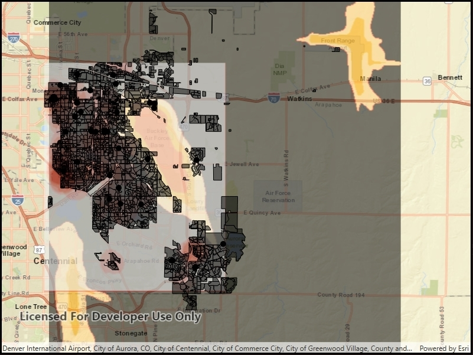

# Add rasters and feature tables from geopackage

Add rasters and feature tables from a GeoPackage to a map.

## Use case

The OGC GeoPackage specification defines an open standard for sharing raster and vector data. GeoPackages are designed to simplify file management and transfer. An end-user wishing to transfer rasters from ArcGIS Pro or between ArcGIS Maps SDK apps, might need to import raster files from GeoPackages into their map to view and analyze the data.

## How to use the sample

When the sample loads, the feature tables and rasters from the GeoPackage will be shown on the map.

## How it works

1. Open the GeoPackage using `GeoPackage.OpenAsync(path)`.
2. Iterate through available rasters exposed by `geopackage.GeoPackageRasters`.
    * For each raster, create a raster layer using `new Rasterlayer(geopackageRaster)`, then add it to the map.
3. Iterate through available feature tables, exposed by `geopackage.GeoPackageFeatureTables`.
    * For each feature table, create a feature layer using `new FeatureLayer(geopackageFeatureTable)`, then add it to the map.

## Relevant API

* FeatureLayer
* GeoPackage
* GeoPackage.GeoPackageFeatureTables
* GeoPackage.GeoPackageRasters
* GeoPackageFeatureTable
* GeoPackageRaster
* RasterLayer

## Offline data

This sample features a [Aurora Colorado GeoPackage](https://www.arcgis.com/home/item.html?id=68ec42517cdd439e81b036210483e8e7) that holds datasets that cover Aurora, Colorado. It has various data including Public art (points), Bike trails (lines), Subdivisions (polygons), Airport noise (raster), and liquor license density (raster).

## Additional information

GeoPackage uses a single SQLite file (.gpkg) that conforms to the OGC GeoPackage Standard. You can create a GeoPackage file (.gpkg) from your own data using the create a SQLite Database tool in ArcGIS Pro.

## Tags

container, layer, map, OGC, package, raster, table
