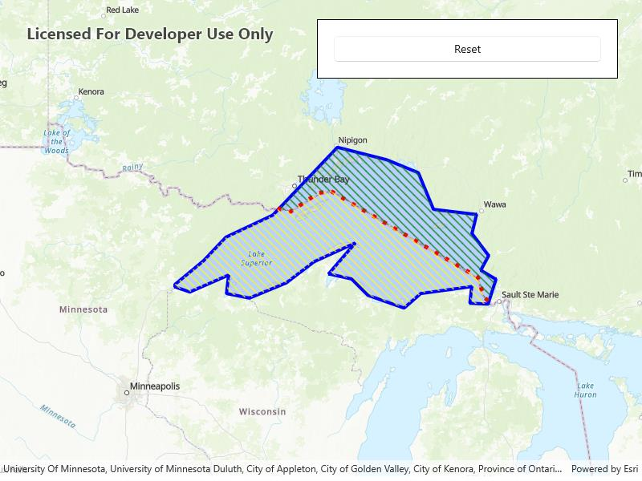

# Cut geometry

Cut a geometry along a polyline.

## Use case

You might cut a polygon representing a large parcel to subdivide it into smaller parcels.

## How to use the sample

Click the "Cut" button to cut the polygon with the polyline and see the resulting parts (shaded in different colors).

## How it works

1. Pass the polyline to the static extension method `GeometryEngine.Cut()` to cut the geometry along the polyline.
2. Loop through the returned list of part geometries. Some of these geometries may be multi-part.

## Relevant API

* GeometryEngine.Cut
* Polygon
* Polyline

## Tags

cut, geometry, split