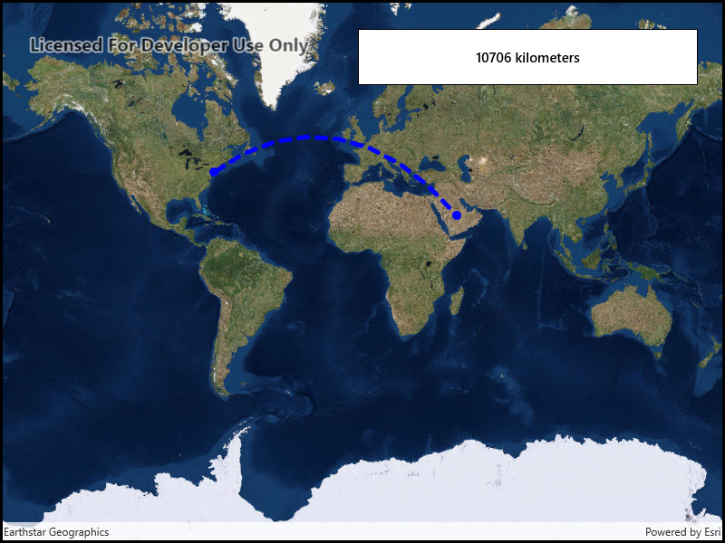

# Geodesic operations

Calculate a geodesic path between two points and measure its distance.

## Use case

A geodesic distance provides an accurate, real-world distance between two points. Visualizing flight paths between cities is a common example of a geodesic operation since the flight path between two airports takes into account the curvature of the earth, rather than following the planar path between those points, which appears as a straight line on a projected map.

## How to use the sample

Click anywhere on the map. A line graphic will display the geodesic line between the two points. In addition, text that indicates the geodesic distance between the two points will be updated. Click elsewhere and a new line will be created.

## How it works

1. A `Point` is created in New York City and displayed as a `Graphic`.
2. When a click occurs on the `MapView`, a new `Point` is obtained from the mouse click. This `Point` is added as a `Graphic`.
3. A `Polyline` is created with the two `Point` objects.
4. `GeometryEngine.DensifyGeodetic` is called from the `Polyline` object, and the returned `Geometry` is stored as `pathGeometry`.
5. `GeometryEngine.LengthGeodetic` is called from `pathGeometry`, and the returned number is displayed on the screen.

## Relevant API

* GeometryEngine.DensifyGeodetic
* GeometryEngine.LengthGeodetic

## About the data

The Imagery basemap provides the global context for the displayed geodesic line.

## Tags

densify, distance, geodesic, geodetic