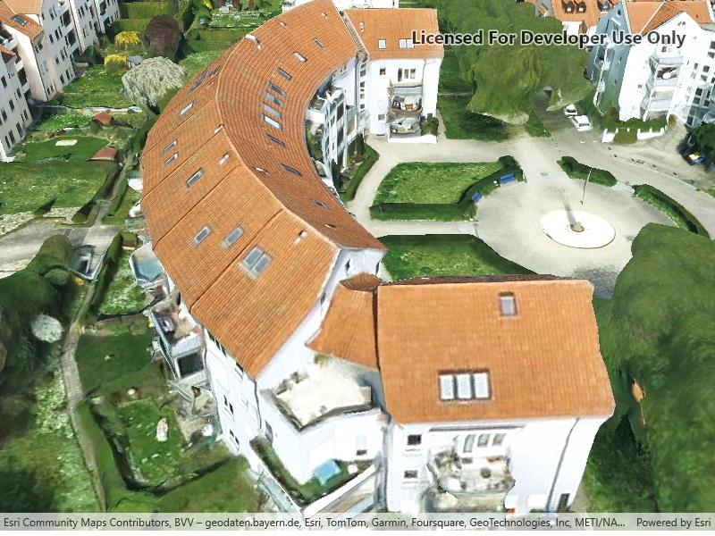

# Add 3d tiles layer

Add a layer to visualize 3D tiles data that conforms to the OGC 3D Tiles specification.

## Use case

One use case for 3D tiles layer in a scene is assisting with visual analysis, such as line of sight analysis. A [line of sight analysis](https://developers.arcgis.com/documentation/mapping-apis-and-services/spatial-analysis/tutorials/apis/display-a-line-of-sight/) can be used to assess whether a view is obstructed between an observer and a target.

## How to use the sample

When loaded, the sample will display a scene with an `Ogc3DTilesLayer`. Pan around and zoom in to observe the scene of the `Ogc3DTilesLayer`. Notice how the layer's level of detail changes as you zoom in and out from the layer.

## How it works

1. Create a scene.
2. Create an `Ogc3DTilesLayer` with the URL to a 3D tiles layer service.
3. Add the layer to the scene's operational layers.

## Relevant API

* Ogc3DTilesLayer
* SceneView

## About the data

A layer to visualize 3D tiles data that conforms to the OGC 3D Tiles specification. As of 200.4, it supports analyses like viewshed and line of sight, but does not support other operations like individual feature identification.

The 3D Tiles Open Geospatial Consortium (OGC) specification defines a spatial data structure and a set of tile formats designed for streaming and rendering 3D geospatial content. A 3D Tiles data set, known as a tileset, defines one or more tile formats organized into a hierarchical spatial data structure. For more information, see the [OGC 3D Tiles specification](https://www.ogc.org/standard/3DTiles).

## Tags

3d tiles, layers, OGC, OGC API, scene, service
