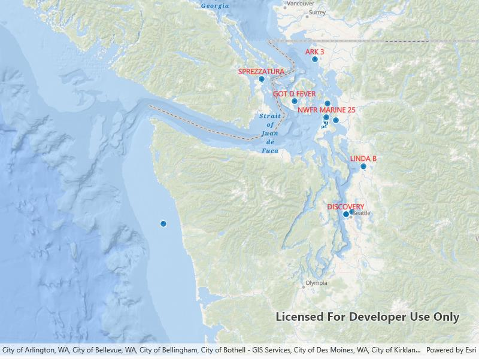

# Add custom dynamic entity data source

Create a custom dynamic entity data source and display it using a dynamic entity layer.

## Use case

Developers can create a custom `DynamicEntityDataSource` to be able to visualize data from a variety of different feeds as dynamic entities using a `DynamicEntityLayer`. An example of this is in a mobile situational awareness app, where a custom `DynamicEntityDataSource` can be used to connect to peer-to-peer feeds in order to visualize real-time location tracks from teammates in the field.

## How to use the sample

Run the sample to view the map and the dynamic entity layer displaying the latest observation from the custom data source. Tap on a dynamic entity to view its attributes in a callout.

## How it works

Configure the custom data source:

1. Create a custom data source implementation of a `DynamicEntityDataSource`.
2. Override `OnLoadAsync()` to specify the `DynamicEntityDataSourceInfo` for a given unique entity ID field and a list of `Field` objects matching the fields in the data source.
3. Override `OnConnectAsync()` to begin processing observations from the custom data source.
4. Loop through the observations and deserialize each observation into a `MapPoint` object and a `Dictionary<string, object>` containing the attributes.
5. Use `DynamicEntityDataSource.AddObservation(mapPoint, attributes)` to add each observation to the custom data source.

Configure the map view:

1. Create a `DynamicEntityLayer` using the custom data source implementation.
2. Update values in the layer's `TrackDisplayProperties` to customize the layer's appearance.
3. Set up the layer's `LabelDefinitions` to display labels for each dynamic entity.
4. Configure a `GeoViewTapped` event handler on the `MapView` to select a dynamic entity and display the entity's attributes in a callout.

## Relevant API

* DynamicEntity
* DynamicEntityDataSource
* DynamicEntityLayer
* LabelDefinition
* TrackDisplayProperties

## About the data

This sample uses a [.json file containing observations of marine vessels in the Pacific North West](https://www.arcgis.com/home/item.html?id=a8a942c228af4fac96baa78ad60f511f) hosted on ArcGIS Online.

## Additional information

In this sample, we iterate through features in a GeoJSON file to mimic messages coming from a real-time feed. You can create a custom dyamic entity data source to process any data that contains observations which can be translated into `MapPoint` objects with associated `Dictionary<string, object>` attributes.

## Tags

data, dynamic, entity, label, labeling, live, real-time, stream, track
