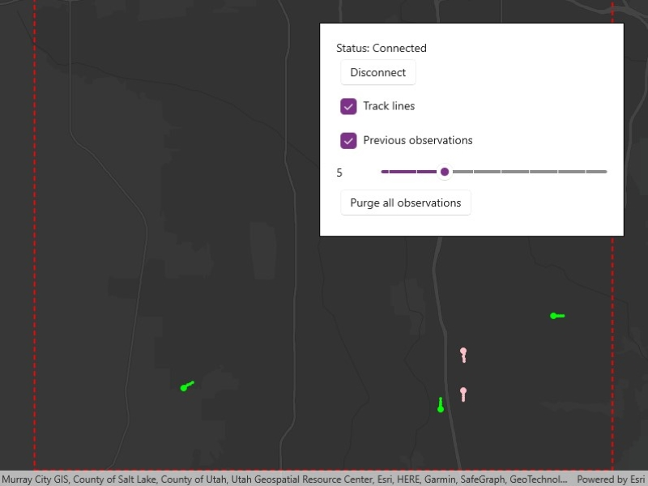

# Add dynamic entity layer

Display data from an ArcGIS stream service using a dynamic entity layer.

## Use case

A stream service is a type of service provided by ArcGIS Velocity and GeoEvent Server that allows clients to receive a stream of data observations via a web socket. ArcGIS Maps SDK for .NET allows you to connect to a stream service and manage the information as dynamic entities and display them in a dynamic entity layer. Displaying information from feeds such as a stream service is important in applications like dashboards where users need to visualize and track updates of real-world objects in real-time.

Use `ArcGISStreamService` to manage the connection to the stream service and purge options to manage how much data is stored and maintained by the application. The dynamic entity layer will display the latest received observation, and you can set track display properties to determine how to display historical information for each dynamic entity. This includes the number of previous observations to show, whether to display track lines in-between previous observations, and setting renderers.

## How to use the sample

Use the controls to connect to or disconnect from the stream service, modify display properties in the dynamic entity layer, and purge all observations from the application.

## How it works

1. Create an `ArcGIStreamService` using a `Uri`.
2. Set a `DynamicEntityFilter` on the stream service to limit the amount of data coming from the server.
3. Set the `MaximumDuration` property of the stream service `PurgeOptions` to limit the amount of data managed by the application.
4. Create a `DynamicEntityLayer` using the stream service.
5. Update values in the layer's `TrackDisplayProperties` to customize the layer's appearance.
6. Add the `DynamicEntityLayer` to the map.

## Relevant API

* ArcGISStreamService
* ArcGISStreamServiceFilter
* ConnectionStatus
* DynamicEntity
* DynamicEntityLayer
* DynamicEntityPurgeOptions
* TrackDisplayProperties

## About the data

This sample uses a [stream service](https://realtimegis2016.esri.com:6443/arcgis/rest/services/SandyVehicles/StreamServer) that simulates live data coming from snowplows near Sandy, Utah. There are multiple vehicle types and multiple agencies operating the snowplows.

## Additional information

More information about dynamic entities can be found in the [guide documentation](https://developers.arcgis.com/net/real-time/work-with-dynamic-entities/).

## Tags

data, dynamic, entity, live, purge, real-time, service, stream, track
