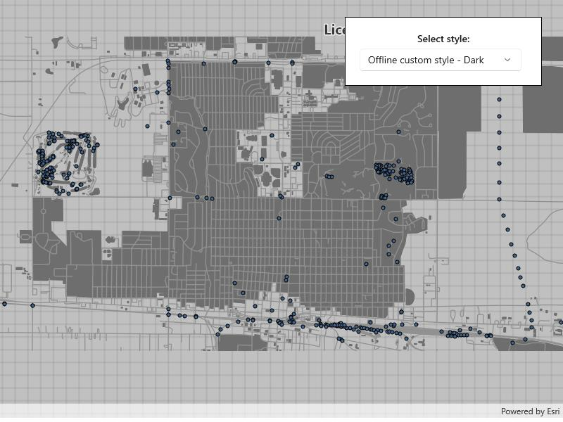

# Add vector tiled layer from custom style

Load ArcGIS vector tiled layers using custom styles.

## Use case

Vector tile basemaps can be created in ArcGIS Pro and published as offline packages or online services. You can create a custom style tailored to your needs and easily apply them to your map. `VectorTiledLayer` has many advantages over traditional raster based basemaps (`ArcGISTiledLayer`), including smooth scaling between different screen DPIs, smaller package sizes, and the ability to rotate symbols and labels dynamically.

## How to use the sample

Pan and zoom to explore the vector tile basemap.

## How it works

1. Construct a list of `VectorTiledLayer` containing each custom style.
2. Set the `Basemap` base layer to the default `VectorTiledLayer`.
3. Update the `Basemap` when a new style is selected.

* Follow these steps to create a vector tiled layer with a custom style from offline resources:
1. Create a `ExportVectorTilesTask` from the create asynchronous task using `vectorTiledLayer.Source` as a parameter.
2. Create a `ExportVectorTilesParameters` parameters, calling `CreateDefaultExportVectorTilesParametersAsync()` from the `ExportVectorTilesTask` object.
3. Get the tile cache path and item resource path for the base layer styling.
4. Create a `ExportVectorTilesJob` by having your task call `ExportVectorTiles` with the parameters, tile path, and item resource path as parameters.
5. Wait for the job to complete and store as a `ExportVectorTilesResult`.
6. Load the vector tile cache.

## Relevant API

* VectorTiledLayer
* VectorTilesTask
* VectorTileCache

## Tags

tiles, vector, vector basemap, vector tiled layer, vector tiles
