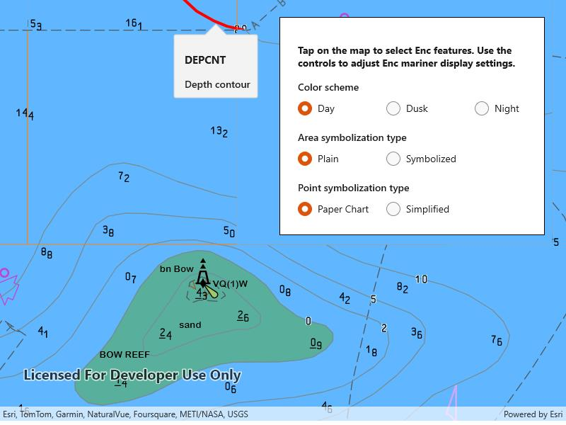

# Configure electronic navigational charts

Display and configure electronic navigational charts per ENC specification.

## Use case

The S-52 standard defines how Electronic Navigational Chart (ENC) content should be displayed to ensure that data is presented consistently across every charting system. S-52 defines several display options, including variations on symbology to ensure that charts are readable both at night and in direct sunlight.

## How to use the sample

When opened, the sample displays an electronic navigational chart. Tap on the map to select Enc features and view the feature's acronyms and descriptions shown in a callout. Tap "Display Settings" and use the options to adjust some of the Enc mariner display settings, such as the colors and symbology.

## How it works

1. To display Enc content:
    1. Create an `EncExchangeSet` using a path to the local Enc exchange set files and load it.
    2. Make an `EncCell` for each of the `EncExchangeSet.Datasets` and then make an `EncLayer` from each cell.
    3. Add the layers to the map using `Map.OperationalLayers.Add()` and create a `MapView` to display the map.
2. To select Enc features:
    1. Use `GeoViewTapped()` on the map view to get the screen point from the tapped location.
    2. Identify nearby features to the tapped location with `IdentifyLayersAsync()`.
    3. From the resulting `IdentifyLayerResult`, get the `EncLayer` from `LayerContent` and the `EncFeature`(s) from `GeoElements`.
    4. Use `EncLayer.SelectFeature()` to select the Enc feature(s).
3. To set Enc display settings:
    1. Get the `EncDisplaySettings` instance from `EncEnvironmentSettings.Default.DisplaySettings`.
    2. Use `MarinerSettings`, `TextGroupVisibilitySettings`, and `ViewingGroupSettings` to access the settings instances and set their properties.
    3. Reset the display settings using `ResetToDefaults()` on the settings instances.

## Relevant API

* EncCell
* EncDataset
* EncDisplaySettings
* EncEnvironmentSettings
* EncExchangeSet
* EncLayer
* EncMarinerSettings
* EncTextGroupVisibilitySettings
* EncViewingGroupSettings
* IdentifyLayerResult

## Offline data

This sample downloads the [ENC Exchange Set without updates](https://www.arcgis.com/home/item.html?id=9d2987a825c646468b3ce7512fb76e2d) item from *ArcGIS Online* automatically.

The latest Hydrography Data can be downloaded from the [*Esri Developer* downloads](https://developers.arcgis.com/downloads/). The `S57DataDictionary.xml` file is contained there.

## Additional information

Read more about [displaying](https://developers.arcgis.com/swift/layers/display-electronic-navigational-charts/) and [deploying](https://developers.arcgis.com/swift/license-and-deployment/deployment/#enc-electronic-navigational-charts-style-directory) electronic navigational charts on *Esri Developer*.

## Tags

ENC, hydrography, identify, IHO, layers, maritime, nautical chart, S-52, S-57, select, settings, symbology
