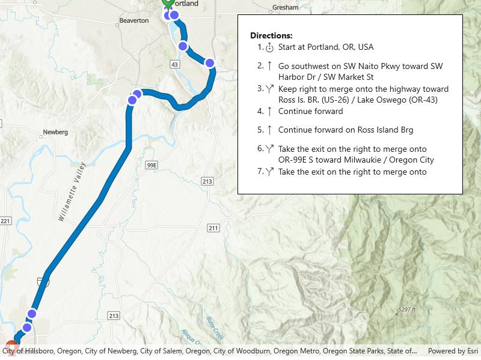

# Display route layer

Display a route layer and its directions using feature collection.

## Use case

Routes can be stored as feature collection layers. These layers can store useful information such as directions, estimated trip time, and more.

You can create a route layer in ArcGIS Pro and store a route layer as a portal item, making it easy to access, share, or display.

## How to use the sample

Pan and zoom to view the route displayed by the feature collection layer. Toggle to view or hide the turn by turn directions.

## How it works

1. Create a `PortalItem` with the default portal and item ID.
2. Create and load a `FeatureCollection` with the item.
3. After loading, get the `FeatureCollectionTable` containing turn by turn directions.
4. Set the `ItemSource` of the collection displaying directions to the `FeatureCollectionTable`.
5. Create a `FeatureCollectionLayer` with the feature collection and set it to the map's `OperationalLayers`.

## Relevant API

* AGSFeatureCollection
* AGSFeatureCollectionLayer
* AGSFeatureCollectionTable

## Tags

directions, feature collection, route layer
