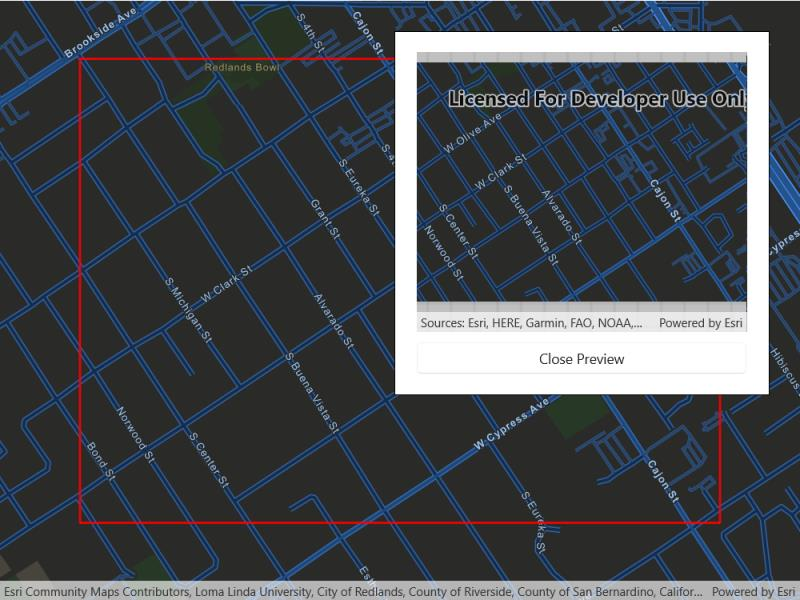

# Export vector tiles

Export tiles from an online vector tile service.

## Use case

Field workers with limited network connectivity can use exported vector tiles as a basemap for use while offline.

## How to use the sample

When the vector tiled layer loads, zoom in to the extent you want to export. The red box shows the extent that will be exported. Tap the "Export vector tiles" button to start exporting the vector tiles. An error will show if the extent is larger than the maximum limit allowed. When finished, a new map view will show the exported result.

## How it works

1. Create an `ArcGISVectorTiledLayer`, from the map's base layers.
2. Create an `ExportVectorTilesTask` using the vector tiled layer's URL.
3. Create default `ExportVectorTilesParameters` from the task, specifying extent and maximum scale.
4. Create an `ExportVectorTilesJob` from the task using the parameters, specifying a vector tile cache path, and an item resource path. The resource path is required if you want to export the tiles with the style.
5. Start the job, and once it completes successfully, get the resulting `ExportVectorTilesResult`.
6. Get the `VectorTileCache` and `ItemResourceCache` from the result to create an `ArcGISVectorTiledLayer` that can be displayed to the map view.

## Relevant API

* ArcGISVectorTiledLayer
* ExportVectorTilesJob
* ExportVectorTilesParameters
* ExportVectorTilesResult
* ExportVectorTilesTask
* ItemResourceCache
* VectorTileCache

## Additional information

Vector tiles have high drawing performance and smaller file size compared to regular tiled layers, due to consisting solely of points, lines, and polygons. However, in ArcGIS Maps SDK for .NET they cannot be displayed in scenes. Visit [ArcGIS for Developers](https://developers.arcgis.com/ios/layers/#layer-types) to learn more about the characteristics of ArcGIS vector tiled layers.

## Tags

cache, download, offline, vector