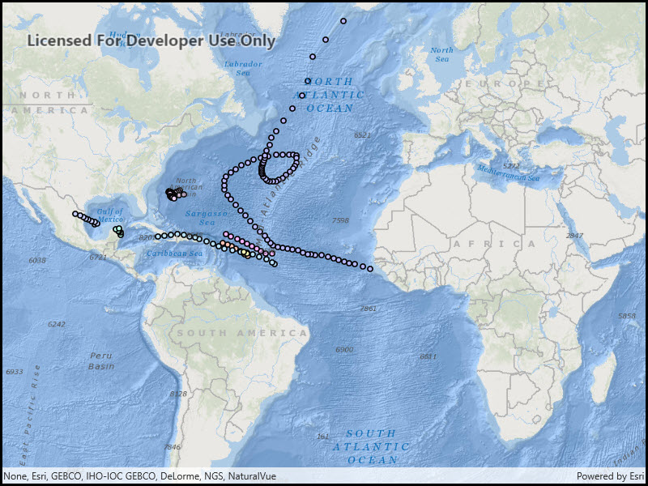

# Time-based query

Query data using a time extent.

## Use case

This workflow can be used to return records that are between a specified start and end date. For example, records of Canada goose sightings over time could be queried to only show sightings during the winter migration time period.

## How to use the sample

Run the sample, and a subset of records will be displayed on the map.

## How it works

1. An instance of `ServiceFeatureTable` is created by passing a URL to the REST endpoint of a time-enabled service. Time-enabled services will have TimeInfo defined in the service description. This information is specified in ArcMap or ArcGIS Pro prior to publishing the service.
2. The feature request mode of the `ServiceFeatureTable` is set to `ManualCache`, so that the developer can control how and when the feature table is populated with data.
3. A `FeatureLayer` is created by passing in the instance of the `ServiceFeatureTable`.
4. A `TimeExtent` object is created by specifying start and end date/time objects.
5. A `QueryParmaters` object is created with the `TimeExtent`.
6. `ServiceFeatureTable.PopulateFromService` is executed by passing in the `QueryParameters`.
7. The feature table is populated with data that matches the provided query.

## Relevant API

* QueryParameters
* ServiceFeatureTable.PopulateFromService
* TimeExtent

## About the data

This sample uses Atlantic hurricane data from the year 2000. The data is from the National Hurricane Center (NOAA / National Weather Service).

## Tags

query, time, time extent
