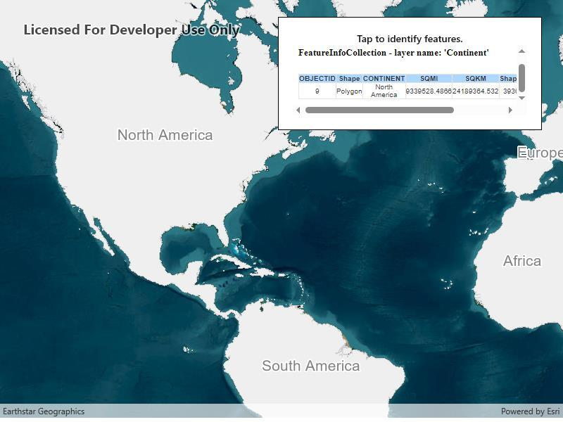

# Identify WMS features

Identify features in a WMS layer and display the associated popup content.

## Use case

Map symbols generally showcase only one or two data points via color or size, but the data can contain many more attributes than what is shown on the map. These additional attributes can be shown in an attribute table or popup for the map viewer to explore interactively. For example, the map might be symbolized to show population density with different shades of a color, but it might contain other interesting attributes to explore in a table, such as median income, educational attainment, and median age.

## How to use the sample

Tap a feature to identify it. The HTML content associated with the feature will be displayed in a web view.

## How it works

1. A WMS layer is added via URL and a layer name.
2. When the map is tapped, `MapView.IdentifyLayerAsync` is used to find matching results within the WMS layer.
3. If there is a matching feature, the HTML property is taken via a lookup in the feature's attribute dictionary.
4. This particular server will produce an identify result with an empty table when there is no identified feature. In all other cases, a table with an **OBJECTID** column is added. This sample checks for the presence of **OBJECTID** in the HTML, and doesn't display the result if it is missing.
5. The HTML is displayed in the web view.

**Note**: the service returns HTML regardless of whether there was an identify result. The sample uses a simple rule to hide empty results.

## Relevant API

* IdentifyLayerResult
* IdentifyLayerResult.GeoElements
* MapView.IdentifyLayerAsync
* WmsFeature
* WmsFeature.Attributes
* WmsLayer

## About the data

This sample shows a map of surface water sources in each U.S. state. States with more surface and ground water sources appear darker blue. The attribute table includes counts of surface and ground water sources. This map service is provided by the U.S. EPA.

## Tags

callout, identify, OGC, web map service, WMS
