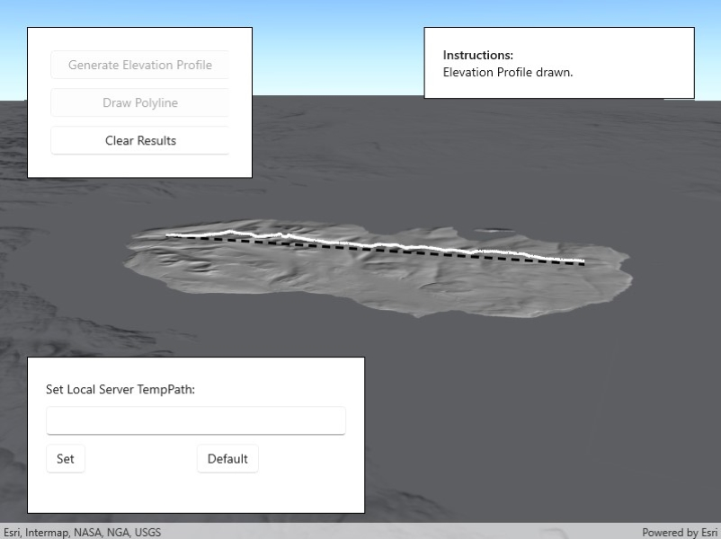

# Generate elevation profile with Local Server

Create an elevation profile using a geoprocessing package executed with Local Server.

## Use case

Applications that include Local Server are valuable in offline workflows that require advanced spatial analysis or data manipulation. This sample uses a geoprocessing package (`.gpkx`) created in ArcGIS Pro involving a custom geoprocessing model that includes the [Interpolate Shape (3D Analyst)](https://pro.arcgis.com/en/pro-app/latest/tool-reference/3d-analyst/interpolate-shape.htm) geoprocessing tool. The geoprocessing package is executed with ArcGIS Local Server.

You can generate elevation profiles to carry out topographical analysis of valley profiles, or visualize a hiking, cycling, or road trip over varied topography.

## How to use the sample

The sample loads at the full extent of the raster dataset. Click the "Draw Polyline" button and sketch a polyline along where you'd like the elevation profile to be calculated (the polyline can be any shape). Click the "Save" button to save the sketch and draw the polyline. Click "Generate Elevation Profile" to interpolate the sketched polyline onto the raster surface in 3D. Once ready, the view will automatically zoom onto the newly drawn elevation profile. Click "Clear Results" to reset the sample.

## How it works

1. Create a `Raster` from a raster dataset, and apply a series of `RasterFunction`s to mask any data at or below sea level.
2. Start the Local Server instance with `LocalServer.Instance.StartAsync()`.
3. Start a `LocalGeoprocessingService` and create a `GeoprocessingTask`.
    1. Instantiate `LocalGeoprocessingService(Url, ServiceType)` to create a local geoprocessing service.
    2. Invoke `LocalGeoprocessingService.StartAsync()` to start the service asynchronously.
    3. Instantiate `GeoprocessingTask.CreateAsync(LocalGeoprocessingService.Url + "/CreateElevationProfileModel")` to create a geoprocessing task that uses the elevation profile tool.
4. Create an instance of `GeoprocessingParameters` and get its list of inputs with `GeoprocessingParameters.Inputs`.
5. Add `GeoprocessingFeatures` with a `FeatureCollectionTable` pointing to a polyline geometry, and `GeoprocessingString` with a path to the raster data on disk to the list of inputs.
6. Create and start a `GeoprocessingJob` using the input parameters.
    1. Create a geoprocessing job with `GeoprocessingTask.CreateJob(GeoprocessingParameters)`.
    2. Start the job with `GeoprocessingJob.Start()`.
7. Add generated elevation profile as a `FeatureLayer` to the scene.
    1. Get the url from the local geoprocessing service using `LocalGeoprocessingService.Url`.
    2. Get the server job id of the geoprocessing job using `GeoprocessingJob.ServerJobId`.
    3. Replace `GPServer` from the url with `MapServer/jobs/jobId`, to get generate elevation profile data.
    4. Create a `ServiceGeodatabase` from the derived url and create a `FeatureLayer` from the first `FeatureTable`.
    5. Set the surface placement mode and add a renderer to the feature layer, then add the new layer to the scene's list of operational layers.

## Relevant API

* GeoprocessingFeatures
* GeoprocessingJob
* GeoprocessingParameter
* GeoprocessingParameters
* GeoprocessingTask
* LocalGeoprocessingService
* LocalGeoprocessingService.ServiceType
* LocalServer
* LocalServerStatus
* Raster
* RasterFunction

## About the data

This sample loads with a [10m resolution digital terrain elevation model](https://www.arcgis.com/home/item.html?id=db9cd9beedce4e0987c33c198c8dfb45) of the Island of Arran, Scotland (data Copyright Scottish Government and Sepa 2014).

[Three raster functions (json format)](https://www.arcgis.com/home/item.html?id=259f420250a444b4944a277eec2c4e42) are applied to the raster data to mask out data at or below sea level.

The geoprocessing task is started with a `gpkx`. This [Create elevation profile geoprocessing package](https://www.arcgis.com/home/item.html?id=831cbdc61b1c4cd3bfedd1af91d09d36) was authored in ArcGIS Pro using ModelBuilder, and the [Interpolate Shape (3D Analyst) tool](https://pro.arcgis.com/en/pro-app/latest/tool-reference/3d-analyst/interpolate-shape.htm).

## Additional information

ArcGIS Maps SDK for Local Server (Local Server) is deprecated and will be retired in 2030. The last release will be ArcGIS Maps SDK for Local Server 200.8, in Q3 2025. For more information, see the [deprecation announcement](https://support.esri.com/en-us/knowledge-base/deprecation-arcgis-maps-sdk-for-local-server-000034908).

The [Package Result](https://pro.arcgis.com/en/pro-app/latest/tool-reference/data-management/package-result.htm) tool in ArcGIS Pro is used to author ArcGIS Maps SDK for Native Apps compatible [geoprocessing](https://pro.arcgis.com/en/pro-app/latest/help/analysis/geoprocessing/basics/what-is-geoprocessing-.htm) packages (.gpkx files). For more information on running powerful offline geoprocessing tasks to provide advanced spatial analysis to your applications, see [ArcGIS Local Server SDK](https://developers.arcgis.com/net/local-server/).

The results of the geoprocessing tasks executed with Local Server can be accessed with code, persisted, and shared, for example as a feature collection portal item. This contrasts with the Scene visibility analyses, viewshed and line of sight, which are calculated dynamically at render-time and are displayed only in analysis overlays.

## Tags

elevation profile, geoprocessing, interpolate shape, local server, offline, parameters, processing, raster, raster function, scene, service, terrain