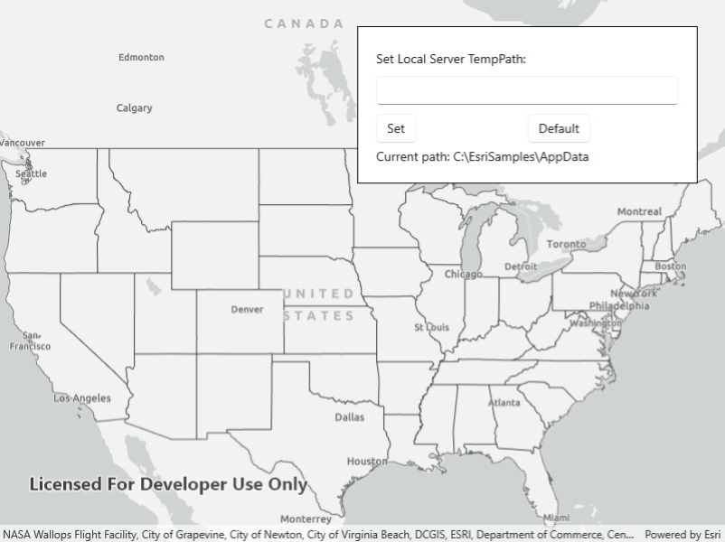

# Local Server map image layer

Start the Local Server and Local Map Service, create an ArcGIS Map Image Layer from the Local Map Service, and add it to a map.

## Use case

For executing offline geoprocessing tasks in your apps via an offline (local) server.

## How to use the sample

The Local Server and local map service will automatically be started and, once running, a map image layer will be created and added to the map.

## How it works

1. Create and run a local server with `LocalServer.Instance`.
2. Start the server asynchronously with `server.StartAsync()`.
3. Create and run a local service, example of running a `LocalMapService`.
    1. Instantiate `LocalMapService(Url)` to create a local map service with the given URL path to the map package (`mpkx` file).
    2. Start the service asynchronously with `LocalMapService.StartAsync()`. The service is added to the Local Server automatically.
4. Create an ArcGIS map image layer from local map service.
   1. Create a `ArcGISMapImageLayer(Url)` from local map service url provided by the `LocalMapService.Url` property.
   2. Add the layer to the map's operational layers. 
   3. Wait for the layer to load with `await myImageLayer.LoadAsync()`
   4. Set the map view's extent to the layer's full extent.

## Relevant API

* ArcGISMapImageLayer
* LocalMapService
* LocalServer
* LocalServerStatus

## Offline data

This sample downloads the following items from ArcGIS Online automatically:

* [RelationshipID.mpkx](https://www.arcgis.com/home/item.html?id=85c34847bbe1402fa115a1b9b87561ce) - This map package is included in the ArcGIS sample data.

## Additional information

ArcGIS Maps SDK for Local Server (Local Server) is deprecated and will be retired in 2030. The last release will be ArcGIS Maps SDK for Local Server 200.8, in Q3 2025. For more information, see the [deprecation announcement](https://support.esri.com/en-us/knowledge-base/deprecation-arcgis-maps-sdk-for-local-server-000034908).

## Tags

image, layer, local, offline, server
